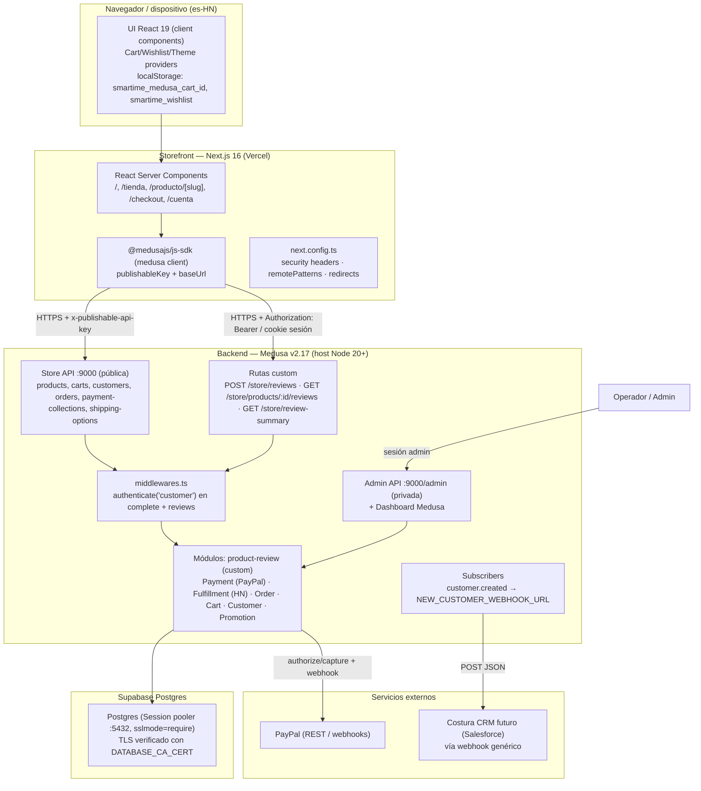
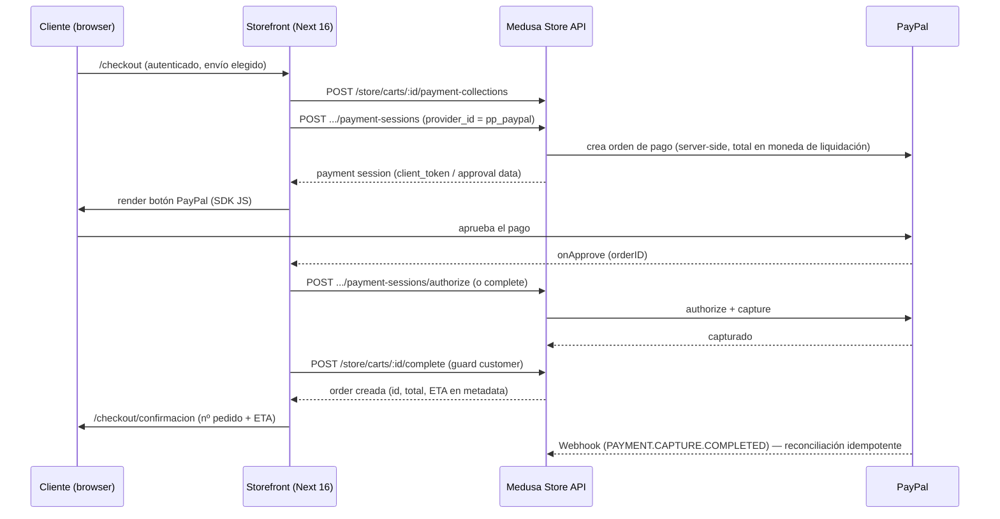
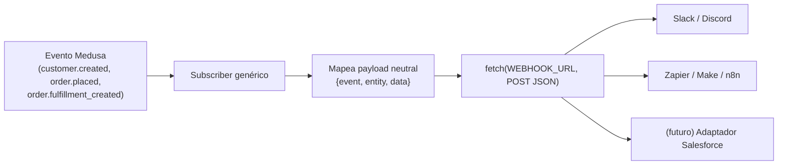
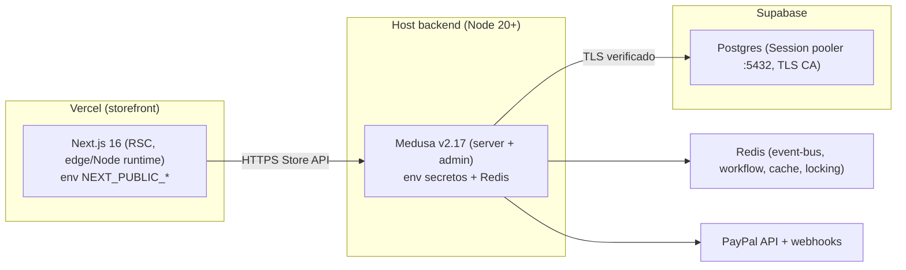

# 02 — TRD (Technical Requirements Document) — smartime

> **Producto:** smartime — storefront headless de Honduras (HNL). Especialista Apple + electrónica de consumo.
> **Stack:** Storefront **Next.js 16** (App Router, RSC, React 19, Tailwind 4, shadcn/ui) ⇄ Backend **Medusa v2.17** (Postgres en Supabase, MikroORM+Knex). Dos repos hermanos: `store/` y `medusa/`.
> **Autor:** Arquitectura de software.
> **Estado:** Vigente. Documento maestro técnico. Operacionaliza el `01-PRD.md`.
> **Fecha:** 2026-06-29.

### Documentos relacionados (cruce de referencias)

| Doc | Para qué consultarlo |
|---|---|
| **`01-PRD.md`** | *Qué* construimos y *por qué*: RF (RF-CHK-01…), RNF (RNF-SEC-01…), decisiones bloqueadas D1–D5, métricas. |
| **`02-TRD.md`** (este) | *Cómo* se implementa cada RF: arquitectura, APIs, pagos, envíos, seguridad, despliegue. |
| **`03-UXUI-system.md`** | Detalle visual/interacción de pantallas y componentes. |
| **`04-app-flow.md`** | Recorridos extremo a extremo (carrito → checkout → pago → pedido). |
| **`05-schema-db.md`** | Modelo de datos: entidades core Medusa + módulos custom (review, wishlist futuro). |
| **`06-implementation-plan.md`** | Secuencia de entrega por fases, dependencias y estimaciones. |

> Fuente estratégica: **`../COMPETITOR_ANALYSIS.md`** y **`../MEDUSA_PLAN.md`**.

**Convención de decisiones bloqueadas** (de `01-PRD.md §0`): **D1** checkout con cuenta obligatoria (sin invitado); **D2** fulfillment nativo Medusa + ETA + retiro en tienda; **D3** estado de pedido + fecha en `/cuenta`; **D4** Salesforce no urge (solo costura webhook); **D5** superficie de API/webhooks definida. Donde una sección de este TRD tiene una **decisión técnica abierta**, se listan opciones con **recomendación explícita** (no hay "TBD" vagos).

---

## 1. Arquitectura del sistema

### 1.1 Visión de alto nivel

smartime es **headless**: dos aplicaciones desplegadas por separado, en repos git independientes, que se comunican exclusivamente por HTTP sobre el **Store API** de Medusa. El storefront **nunca** habla con Postgres ni con la Admin API: solo usa la Store API pública (publishable key + Sales Channel HN) y, para operaciones autenticadas, la sesión/bearer del cliente.



### 1.2 Principios arquitectónicos (vinculantes)

1. **Separación estricta front/back.** El storefront es un cliente más de la Store API. No comparte código de servidor con Medusa; el contrato es HTTP + tipos `@medusajs/types`.
2. **Precios y totales SIEMPRE server-side.** El cálculo de precios, descuentos, envío, impuestos y total lo hace Medusa (Pricing/Cart/Tax). El front solo **formatea** (`src/utilities/format.ts`). El `CuotaBadge` divide un precio ya calculado por el servidor — nunca define precios.
3. **Unidades mayores de HNL.** `amount = 24999` ⇒ `L 24,999`. **Jamás centavos / división entre 100** (HNL se modela sin minor units en la región). Ver `RNF-I18N-03`. **Nota de alineación doc↔código:** `formatPrice` (`src/utilities/format.ts`) usa `minimumFractionDigits: 0` **y** `maximumFractionDigits: 2` — es decir, puede mostrar hasta 2 decimales si el `amount` trae fracción; la regla "sin centavos" depende de **sembrar importes enteros** (`RNF-I18N-02`), no del formateador.
4. **No exponer inventario crudo** (`RNF-SEC-07`): el principio vigente hoy es **no serializar la cantidad de inventario al cliente**. El mapeo a estados (`En stock` / `Últimas unidades` / `Agotado`) está **PENDIENTE** — hoy `toViewProduct` (`src/lib/medusa/data.ts`) fija `inStock: true` **hardcodeado**, sin leer `inventory_level` ni derivar estado. El mapeo de estados de stock es un **gap a implementar en una fase futura (Fase 2/3)** leyendo `inventory_level`.
5. **Publishable key ↔ Sales Channel HN** obligatorio: sin el enlace, los listados salen vacíos (Store API filtra por sales channel del publishable key).

---

## 2. Stack y versiones exactas

### 2.1 Storefront (`store/package.json`)

| Componente | Versión | Notas |
|---|---|---|
| Next.js | **16.2.6** | App Router, RSC, `force-dynamic` en `/`, `/tienda`, `/producto/[slug]`. Turbopack root fijado en `next.config.ts`. |
| React / React DOM | **19.2.6** | Server + client components. |
| TypeScript | **5.7.3** | `strict`. |
| Tailwind CSS | **4.1.18** | `@tailwindcss/postcss`, `@tailwindcss/typography`, `tw-animate-css`. Tokens en `globals.css`. |
| @medusajs/js-sdk | **^2.17.1** | Cliente Store API (`src/lib/medusa/sdk.ts`). |
| @medusajs/types | **^2.17.1** | Tipos compartidos. |
| shadcn/ui + Radix | checkbox 1.x, label 2.x, select 2.x, slot 1.x | `class-variance-authority`, `clsx`, `tailwind-merge`. |
| lucide-react | 0.563.0 | Iconografía. |
| geist | ^1.3.0 | Fuentes (Fraunces/Poppins se cargan vía CSS/layout). |
| Testing | Vitest **4.0.18**, Playwright **1.58.2**, @testing-library/react 16.3.0, jsdom 28 | `test:int` (vitest), `test:e2e` (playwright). |
| Lint/format | ESLint 9 + `eslint-config-next` 16.2.6, Prettier 3 | |
| Runtime | **Node 20+**, **pnpm 11** (`--ignore-workspace`) | `cross-env NODE_OPTIONS=--no-deprecation`. |

### 2.2 Backend (`medusa/package.json`)

| Componente | Versión | Notas |
|---|---|---|
| @medusajs/framework, @medusajs/medusa | **2.17.0** | Núcleo v2. |
| @medusajs/cli | **2.17.0** | ⚠️ Gotcha: CLI 2.12.2/2.12.3 cuelga en Node 22; en 2.17.x resuelto. |
| @medusajs/dashboard, admin-sdk, admin-shared | 2.17.0 | Admin embebido en `:9000/app`. |
| @medusajs/draft-order, caching | 2.17.0 | Draft orders y caché. |
| @medusajs/ui | 4.1.15 | Widgets admin custom. |
| zod | **4.2.0** | Validación de rutas custom (`PostStoreReviewSchema`). |
| @tanstack/react-query, react-router-dom, react-i18next | 5.64.2 / 6.30.3 / 13.5.0 | Para extensiones del dashboard. |
| ORM | MikroORM + Knex (dialecto Postgres) | TLS configurable (ver §9). |
| Testing | jest 29 + @medusajs/test-utils 2.17.0, @swc/jest | `test:unit`, `test:integration:modules`, `test:integration:http`. |
| TypeScript | ^5.6.2 | |
| Runtime | **Node >=20** (engines), **pnpm 11.9.0** | Comandos desde `medusa/`. |
| Postgres | Supabase, **Session pooler :5432** | NO Transaction pooler :6543 (rompe prepared statements / migraciones). |

> **Decisión abierta — caché/estado en producción (`RNF-OBS-02`).** Medusa en producción no debe usar módulos en memoria para datos críticos (event bus, workflow engine, locking). **Recomendación:** registrar **Redis** para `@medusajs/event-bus-redis`, `@medusajs/workflow-engine-redis`, `@medusajs/cache-redis` y locking antes del lanzamiento P0 (PayPal y workflows de pedido necesitan persistencia/idempotencia fiable). En dev se acepta in-memory.

---

## 3. Superficie de APIs

### 3.1 Mapa de superficies

| Superficie | Base | Autenticación | Consumidor | Notas |
|---|---|---|---|---|
| **Store API (pública)** | `/store/*` | `x-publishable-api-key` (Sales Channel HN) | Storefront público | Productos, categorías, regiones, carrito, pagos. |
| **Store API (autenticada)** | `/store/customers/me`, `/store/carts/:id/complete`, `POST /store/reviews` | `x-publishable-api-key` **+** sesión cookie o `Authorization: Bearer <JWT>` | Cliente logueado | Guard en `middlewares.ts`. |
| **Rutas custom (Store)** | `/store/reviews`, `/store/products/:id/reviews`, `/store/review-summary` | Mixta (ver §7) | Storefront | Módulo `product-review`. |
| **Admin API (privada)** | `/admin/*` + Dashboard `/app` | Sesión/bearer de **usuario admin** | Operador | NO expuesta al storefront. |
| **Webhooks salientes** | Configurables (`NEW_CUSTOMER_WEBHOOK_URL`, PayPal entrante) | Secreto/firma | Sistemas externos | Ver §10. |

### 3.2 Store API pública (catálogo, vía `@medusajs/js-sdk`)

El cliente SDK (`src/lib/medusa/sdk.ts`) se instancia con `baseUrl = NEXT_PUBLIC_MEDUSA_BACKEND_URL` y `publishableKey = NEXT_PUBLIC_MEDUSA_PUBLISHABLE_KEY`. Métodos usados hoy (verificado en `src/lib/medusa/data.ts`):

- `medusa.store.region.list()` → región HNL (`getRegionId`, cacheada con `React.cache`).
- `medusa.store.category.list({ fields, limit })` → categorías (`listCategories`, cacheada).
- `medusa.store.product.list(...)` con `PRODUCT_FIELDS = '*variants.calculated_price,*categories,*images,+thumbnail,+metadata'` → listados; se pasa `region_id` para precios calculados.
- `medusa.store.cart.*` (create, retrieve, createLineItem, updateLineItem, deleteLineItem) → carrito server-side.
- `medusa.store.customer.*` (retrieve, create) → perfil.
- `medusa.auth.login / register` → emailpass.
- `medusa.client.fetch(path, { query })` → rutas custom (reseñas, review-summary).

> **Importante:** todas las llamadas de catálogo deben incluir `region_id` (HNL) para que `calculated_price` venga poblado; sin región, `calculated_amount` llega `0`. `getRegionId()` resuelve la región por `currency_code === 'hnl'`.

### 3.3 Rutas custom existentes (módulo `product-review`)

| Método | Ruta | Auth | Descripción |
|---|---|---|---|
| `POST` | `/store/reviews` | **customer** (`session`,`bearer`) + Zod | Crea reseña; verifica compra contra órdenes → `verified` + `status`. |
| `GET` | `/store/products/:id/reviews` | pública | Reseñas `approved` (orden `created_at` desc) + promedio + conteo. |
| `GET` | `/store/review-summary?product_ids=prod_1,prod_2` | pública | `{ [id]: { average, count } }` para listados. |
| `GET` | `/store/custom` | pública | Health check (`route.ts`, devuelve `200`). |
| `GET` | `/admin/custom` | admin | Health check del módulo. |

`PostStoreReviewSchema` (verificado): `title?`, `content` (min 1), `rating` (preprocesado a número, 1–5), `product_id`, `first_name` (min 1), `last_name?`.

### 3.4 Rutas a construir (P0)

| Método | Ruta | Auth | RF | Estado |
|---|---|---|---|---|
| `GET` | `/store/customers/me/orders` | customer | RF-ORD-01/02 (D3) | **A construir.** Lista pedidos del cliente con estado pago/fulfillment + ETA. Puede usarse la ruta estándar de Medusa `/store/orders` (filtra por customer autenticado) y, si hace falta exponer ETA derivada, una ruta custom que enriquezca el payload. **Recomendación:** usar `/store/orders` nativa y añadir ETA en metadata del pedido (ver §6). |
| `POST` | `/store/carts/:id/payment-collections` + `payment-sessions` | customer | RF-PAY-01 | **A cablear** (existe en Medusa, falta UI y provider PayPal). |
| `POST` | `/store/carts/:id/complete` | **customer (guard ya existe)** | RF-CHK-03 | Guard implementado; falta el flujo previo (envío + pago). |

### 3.5 El GUARD de checkout autenticado (verificado)

`medusa/src/api/middlewares.ts` define (código real):

```ts
{ method: ["POST"], matcher: "/store/carts/:id/complete",
  middlewares: [authenticate("customer", ["session", "bearer"])] }
{ method: ["POST"], matcher: "/store/reviews",
  middlewares: [authenticate("customer", ["session", "bearer"]), validateAndTransformBody(PostStoreReviewSchema)] }
```

Esto cumple **D1** a nivel de backend: ningún actor (storefront, script externo) puede completar un carrito sin cliente autenticado. El storefront debe, por tanto, **redirigir a `/login?redirect=/checkout`** antes del pago (RF-CHK-01) — el guard es la última línea de defensa, no la única.

---

## 4. Modelo de autenticación

### 4.1 Auth de cliente (Medusa customer auth)

- **Proveedor:** `emailpass` (Medusa Auth Module). Registro: `medusa.auth.register('customer','emailpass',{email,password})` + `medusa.store.customer.create(...)`. Login: `medusa.auth.login('customer','emailpass',{email,password})`.
- **Token:** el SDK obtiene un **JWT** que representa al cliente. Dos modos de transporte aceptados por el guard: `session` (cookie) y `bearer` (Authorization header).
- **MVP — modo bearer en cliente.** El JWT vive **client-side** (lo gestiona `@medusajs/js-sdk`, persistido por el SDK). Gotcha conocido: un JWT en almacenamiento del cliente **no es visible** para los Server Components, por lo que las operaciones autenticadas (retrieve customer, completar carrito, crear reseña) se ejecutan desde **client components** en el MVP.

### 4.2 Cómo el storefront mantiene la sesión

| Estado | Dónde vive | Notas |
|---|---|---|
| Token de cliente (JWT) | Gestionado por `@medusajs/js-sdk` (client-side) | Adjuntado como `Authorization: Bearer` por el SDK. |
| `cart_id` | `localStorage` → `smartime_medusa_cart_id` | `CartProvider`. El carrito es server-side; solo el id se guarda. |
| Wishlist | `localStorage` → `smartime_wishlist` | `WishlistProvider` (MVP). Migración a módulo Medusa en P2. |
| Ciudad (ETA buy box) | cookie | RF-PDP-03: recordar ciudad entre páginas. |

### 4.3 Vinculación carrito ↔ cliente en checkout

1. Visitante agrega ítems → `cart` anónimo (id en localStorage).
2. Al entrar a `/checkout` sin sesión → redirección a `/login?redirect=/checkout` (RF-CHK-01).
3. Tras login, se **asocia el cliente al carrito** (`cart.update({ customer_id })` o el endpoint de transferencia de carrito de Medusa) para que `complete` pase el guard y la orden quede ligada al customer.
4. `complete` exige bearer/session válido (§3.5).

> **Decisión abierta — sesión en RSC (post-MVP).** Para renderizar `/cuenta` y pedidos en el servidor sin parpadeo, se puede mover a **cookie de sesión httpOnly** (transporte `session`) leída en RSC. **Recomendación:** mantener bearer client-side en P0 (menor cambio) y evaluar cookie httpOnly en P1 si la UX de `/cuenta` lo requiere; no es bloqueante para D1/D3.

---

## 5. Pagos: PayPal vía Payment Module de Medusa

### 5.1 Arquitectura de pago

PayPal se integra como **Payment Provider** del **Payment Module** de Medusa v2 (no como plugin v1, no como integración ad-hoc en el front). El front nunca ve secretos de PayPal: solo orquesta el SDK de PayPal en el navegador y confirma contra Medusa.



### 5.2 Flujo authorize / capture

- **authorize:** al aprobar el cliente, Medusa autoriza el pago a través del provider PayPal sobre la `payment_session` del carrito.
- **capture:** captura inmediata tras autorización (e-commerce de bienes físicos con envío rápido). Medusa marca la `payment` como capturada y `complete` convierte el carrito en `order`.
- **Idempotencia:** `complete` y el webhook de PayPal deben ser idempotentes — un mismo `cart_id`/`capture_id` no puede generar dos pedidos pagados. Medusa maneja esto con la payment collection; el webhook solo **reconcilia** estado (no crea pedidos).
- **Fallo/cancelación (RF-PAY-01):** si PayPal falla o se cancela, **no** se llama a `complete`; el carrito permanece intacto y reintentar es posible. No se crea pedido pagado.

### 5.3 Precios SIEMPRE server-side

- El **total** se toma de `cart.total` calculado por Medusa (incluye envío e impuestos). El front lo formatea con `formatPrice` pero **no** lo recalcula ni lo envía como input de confianza.
- **Sin cargos ocultos** (RF-PAY-01, diferenciador vs USD 1 de La Curacao): no se añade ningún recargo de "verificación".

### 5.4 Decisión abierta — moneda de liquidación PayPal (R2 del PRD)

PayPal **no liquida en HNL**. Opciones:

| Opción | Descripción | Pros | Contras |
|---|---|---|---|
| **A (recomendada)** | **Mostrar HNL** en toda la UI; la **región de pago/liquidación** usa una moneda soportada (p. ej. USD) con **tasa de conversión transparente** mostrada en el resumen antes de pagar. | Cumple "transparencia total"; PayPal soportado. | Requiere fijar/actualizar tasa HNL→USD (config de negocio); reconciliación contable. |
| B | Operar la cuenta PayPal en una región que acepte HNL como currency de display y liquide en otra. | Menos UI de conversión. | PayPal puede no soportar HNL como transacción; riesgo de rechazo. |
| C | Diferir PayPal y lanzar con pago local primero. | Evita el problema de moneda. | Contradice el roadmap P0 (PayPal es MVP). |

**Recomendación:** **Opción A.** Definir `HNL→<moneda_liquidación>` como parámetro de negocio configurable, mostrar el equivalente y la tasa en el paso de pago, registrar la tasa usada en `order.metadata` para trazabilidad. Esta decisión se cruza con `01-PRD.md §10.1 R2`.

---

## 6. Envíos: Fulfillment nativo de Medusa (D2)

### 6.1 Configuración requerida (no existe aún — a construir en P0.2)

| Entidad Medusa | Configuración smartime |
|---|---|
| **Stock Location** | `Tegucigalpa` y `San Pedro Sula` (puntos físicos / bodega). |
| **Fulfillment Set + Service Zones** | Zona `Tegucigalpa`, zona `San Pedro Sula`, zona `Resto del país`. Asociadas al provider de fulfillment **manual** de Medusa (sin outsourcing). |
| **Shipping Profile** | Perfil por defecto que cubre los ~26 productos. |
| **Shipping Options** | (1) **Retiro en tienda** (Tegus / SPS) → tarifa **L 0** (flat rate, `price_type: flat`). (2) **Envío Tegucigalpa**, (3) **Envío SPS**, (4) **Envío resto del país** → tarifas planas por zona. Envío gratis sobre umbral se modela con **Promotion Module** (P1.5). |

### 6.2 Cálculo y exposición de la FECHA ESTIMADA (ETA) — O9 = 100%

Medusa **no** tiene un campo nativo de ETA en Shipping Option. **Decisión de diseño:**

| Opción | Implementación | Recomendación |
|---|---|---|
| **A (recomendada)** | Guardar `min_days`/`max_days` en `shipping_option.metadata` (p. ej. Tegus `{min:1,max:2}`, SPS `{min:1,max:2}`, resto `{min:3,max:5}`, retiro `{min:0,max:1}`). El front calcula la fecha real = `hoy + N días hábiles` y la formatea es-HN. | ✅ Simple, configurable por operador, sin servicio externo. |
| B | Servicio de ETA dinámico (festivos HN, capacidad). | Sobreingeniería para MVP. |

**Flujo de exposición de ETA:**
1. **PDP / Buy box (RF-PDP-03):** el front lee la ciudad (cookie) y muestra el rango de la zona correspondiente ("Llega entre el X y el Y").
2. **Checkout (RF-SHIP-03):** al elegir un Shipping Option, el resumen muestra **tarifa + ETA** calculada desde `metadata`. SIEMPRE visible antes de pagar (O9).
3. **Persistencia en pedido:** al completar, se escribe la **ETA congelada** (fechas absolutas) en `order.metadata.eta` para que `/cuenta` la muestre igual (RF-ORD-02) y no cambie con el tiempo.

### 6.3 Estados de fulfillment expuestos en `/cuenta` (D3)

El operador cambia el estado desde el dashboard; el storefront es **solo lectura**. Mapeo a etiquetas es-HN:

| Estado Medusa (fulfillment) | Etiqueta storefront |
|---|---|
| not_fulfilled / pendiente | "En preparación" |
| fulfilled / shipped | "Enviado" |
| (shipping option = retiro) | "Listo para retiro" |
| delivered | "Entregado" |

El estado de **pago** (`order.payment_status`) se muestra aparte ("Pagado").

> **Nota — estado de stock variable (PENDIENTE).** El mapeo de inventario a estados de producto (`En stock` / `Últimas unidades` / `Agotado`) **no está implementado hoy**: `toViewProduct` (`src/lib/medusa/data.ts`) fija `inStock: true` hardcodeado, sin leer `inventory_level`. Es un **gap a implementar en una fase futura (Fase 2/3)**; lo único vigente hoy es no exponer la cantidad cruda (ver §1.2 punto 4).

---

## 7. Módulo de reseñas (`product-review`)

### 7.1 Modelo y servicio (verificado)

- **Modelo `Review`** (`src/modules/product-review/models/review.ts`): `id` (PK), `title?`, `content`, `rating` (float, CHECK 1–5), `first_name`, `last_name?`, `verified` (bool, default false), `status` (enum `pending`/`approved`/`rejected`, default `pending`), `product_id` (indexado `IDX_REVIEW_PRODUCT_ID`), `customer_id?`, timestamps + soft-delete. Tabla `review`. Migración `Migration20260629060707.ts`.
- **Servicio `ProductReviewModuleService`** (`MedusaService({ Review })`): `getAverageRating(productId)` → número a 1 decimal; `getSummaries(productIds[])` → `Record<id,{average,count}>`. Solo cuenta `status='approved'`.

### 7.2 Flujo de creación verificada (verificado en `route.ts`)

`POST /store/reviews` (auth customer): toma `customer_id = req.auth_context.actor_id`, hace `query.graph({ entity:"order", fields:["id","items.product_id"], filters:{ customer_id } })`, y si alguna orden contiene `input.product_id` ⇒ `verified=true` + `status='approved'`; si no ⇒ `status='pending'` (moderación). Ejecuta `createReviewWorkflow` (con rollback `deleteReviews`).

### 7.3 Moderación (RF-ADM-01) — gap a cubrir

Hoy no hay UI para aprobar/rechazar pendientes. **A construir:** rutas Admin `POST /admin/reviews/:id/approve|reject` (o widget en dashboard) que cambien `status`. Solo `approved` se muestra en storefront (ya garantizado en el GET público).

---

## 8. Búsqueda y estrategia de caché / SSR

### 8.1 Búsqueda

- **MVP (existe):** búsqueda por texto vía Store API — `medusa.store.product.list({ q, limit })`. `SearchBar` con debounce 250 ms, 6 sugerencias. Facetas en `/tienda` (marca, categoría, rango de precio, oferta) aplicadas **server-side** vía `searchParams`, preservadas en la URL.
- **P1:** facetas Apple (modelo/chip/almacenamiento/color) — modeladas como **opciones de variante** o `metadata` y filtradas server-side.
- **Decisión abierta — motor de búsqueda dedicado (escala, R7).** Para catálogo grande, integrar **Meilisearch** (módulo de Medusa) mejora relevancia/velocidad. **Recomendación:** con ~26 productos, la búsqueda nativa basta para P0/P1; planificar Meilisearch solo si el catálogo crece o la latencia de `q` degrada (>200 ms p75).

### 8.2 Estrategia de caché / render (Next.js 16)

| Ruta | Render | Razón |
|---|---|---|
| `/` (home) | `force-dynamic` | Datos frescos de catálogo/precios; streaming RSC. |
| `/tienda` | `force-dynamic` | Facetas dependen de `searchParams`. |
| `/producto/[slug]` | `force-dynamic` | Precio/stock/reseñas frescos; `getProductByHandle` **no** cacheado per-request. |
| `/carrito`, `/checkout`, `/cuenta` | client / dinámico | Estado de usuario; no cacheable. |

- **Caché de datos (`RNF-PERF-04`):** `getRegionId`, `listCategories`, `listProducts` usan **`React.cache()`** (deduplicación por request).
- **Decisión abierta — `revalidate` vs `force-dynamic`.** El catálogo casi-estático (título, imágenes, descripción) podría usar **ISR** (`revalidate` 60–300 s) para mejorar LCP (O5 < 2.5 s), manteniendo **dinámico solo** lo volátil (precio calculado por región, stock-state, reseñas) vía segmentos o fetch sin caché. **Recomendación:** medir LCP en P0 con `force-dynamic`; si no se alcanza < 2.5 s p75, migrar las partes estables de la PDP/listado a `revalidate` y dejar precio/stock como fetch dinámico. No bloquea P0 si el presupuesto de performance se cumple.

---

## 9. Seguridad (D5 + RNF-SEC)

| Área | Implementación (verificada / requerida) | RNF |
|---|---|---|
| **Secretos en front** | Solo `NEXT_PUBLIC_*` (`environment.d.ts`). Ningún secreto en el cliente. | RNF-SEC-01 |
| **Cabeceras de seguridad** | `next.config.ts` aplica a `/:path*`: `X-Content-Type-Options: nosniff`, `X-Frame-Options: SAMEORIGIN`, `Referrer-Policy: strict-origin-when-cross-origin`, `Permissions-Policy: camera=(),microphone=(),geolocation=()`, `Strict-Transport-Security: max-age=63072000; includeSubDomains; preload`. | RNF-SEC-02 |
| **CORS sin comodín** | `medusa-config.ts` usa `storeCors`/`adminCors`/`authCors` desde env (sin `*`). `STORE_CORS` ≠ `AUTH_CORS`: **ambas necesarias** (gotcha). | RNF-SEC-03 |
| **TLS a Supabase** | `databaseDriverOptions.connection.ssl`: con `DATABASE_CA_CERT` → `rejectUnauthorized:true` + `ca`; sin CA → conexión cifrada **sin verificar** + warning en prod. **Producción debe definir `DATABASE_CA_CERT`.** Session pooler :5432, `?sslmode=require`. | RNF-SEC-04, R8 |
| **Guards de negocio** | `authenticate("customer")` en `POST /store/carts/:id/complete` (D1) y `POST /store/reviews`. | RNF-SEC-05 |
| **No-venta-sin-cuenta** | Guard backend (última línea) + redirección front `/login?redirect=/checkout`. | D1 |
| **Inventario no expuesto** | Mapear a estados en el servidor; no serializar cantidad cruda. | RNF-SEC-07, R5 |
| **Rate limiting** | ⚠️ **Gap conocido.** `POST /store/reviews` y endpoints públicos sin rate limit. **Recomendación:** middleware de rate limit (por IP + customer) en rutas públicas sensibles; en Vercel/host se puede complementar con WAF/edge. Prioridad P0.6/P1. | RNF-SEC-06, R4 |
| **Validación de entrada** | Zod en `/store/reviews` (`validateAndTransformBody`). Extender a futuras rutas custom. | — |
| **Webhook PayPal** | Verificar firma/transmission-id de PayPal antes de procesar; rechazar no firmados. | §10 |

---

## 10. Costura de integraciones / webhooks (D4, D5)

### 10.1 Eventos Medusa + subscriber existente (verificado)

`src/subscribers/customer-created.ts` escucha `customer.created`: siempre `logger.info`; si `NEW_CUSTOMER_WEBHOOK_URL` está definido, hace `POST` JSON `{ text, content, customer:{id,name,email} }` (compatible Slack/Discord/Zapier/Make/n8n). Si la URL no está, solo loguea (sin fallo). **Esta es la costura para CRM futuro (D4)** — no se construye Salesforce ahora.

### 10.2 Patrón de endpoint para integraciones futuras (Salesforce)



**Recomendación de superficie de eventos para la costura CRM (P0.6, sin construir CRM):**

| Evento Medusa | Subscriber | Variable env | Uso futuro |
|---|---|---|---|
| `customer.created` | ✅ existe | `NEW_CUSTOMER_WEBHOOK_URL` | Alta de lead/contacto en CRM. |
| `order.placed` | a añadir (P0.6) | `ORDER_PLACED_WEBHOOK_URL` (propuesto) | Oportunidad/venta en CRM. |
| `order.fulfillment_created` | a añadir (P1) | `FULFILLMENT_WEBHOOK_URL` (propuesto) | Notificación de envío. |

Mantener el **payload neutral** (no acoplar a Salesforce) para que el adaptador viva fuera (Zapier/Make o un microservicio) — coherente con D4.

### 10.3 Webhook entrante de PayPal

Endpoint en Medusa (provider PayPal) que recibe `PAYMENT.CAPTURE.COMPLETED` / `.DENIED`, **verifica la firma**, y reconcilia el estado del pago de forma **idempotente** (no crea pedidos; solo actualiza estado). Ver §5.2.

---

## 11. Variables de entorno

### 11.1 Storefront (`store/.env`) — solo `NEXT_PUBLIC_*` (verificado en `.env.example`)

| Variable | Ejemplo | Obligatoria | Descripción |
|---|---|---|---|
| `NEXT_PUBLIC_MEDUSA_BACKEND_URL` | `http://localhost:9000` / `https://api.smartime.hn` | ✅ | Base URL del Store API. |
| `NEXT_PUBLIC_MEDUSA_PUBLISHABLE_KEY` | `pk_xxx` | ✅ | Publishable key **enlazada al Sales Channel HN** (sin enlace → listados vacíos / 401). |
| `NEXT_PUBLIC_SERVER_URL` | `http://localhost:3000` | ✅ | URL pública del storefront (CORS, links, sitemap). Sin barra final. |
| `NEXT_PUBLIC_WHATSAPP_NUMBER` | `504XXXXXXXX` | ✅ | WhatsApp flotante (formato internacional sin `+`). |
| `NEXT_PUBLIC_PAYPAL_CLIENT_ID` | `Axxxx` | ✅ (P0) | **A añadir:** client id público del SDK JS de PayPal (no secreto). |

### 11.2 Backend (`medusa/.env`) — secretos (verificado en `.env.template`)

| Variable | Obligatoria | Descripción |
|---|---|---|
| `STORE_CORS` | ✅ | Orígenes del storefront (sin `*`). |
| `ADMIN_CORS` | ✅ | Orígenes del dashboard admin. |
| `AUTH_CORS` | ✅ | Orígenes que hacen login de cliente (≠ STORE_CORS, ambas necesarias). |
| `JWT_SECRET` | ✅ | `openssl rand -base64 32`. |
| `COOKIE_SECRET` | ✅ | `openssl rand -base64 32`. |
| `AUTH_MFA_ENCRYPTION_KEY` | ✅ | Cifrado MFA. |
| `DATABASE_URL` | ✅ | Supabase **Session pooler :5432** `?sslmode=require`. NO :6543. |
| `DATABASE_CA_CERT` | ⚠️ prod | PEM del CA Supabase → `rejectUnauthorized:true`. |
| `MEDUSA_ADMIN_ONBOARDING_TYPE` | — | `default`. |
| `NEW_CUSTOMER_WEBHOOK_URL` | opcional | Costura CRM (D4). |
| `PAYPAL_CLIENT_ID` / `PAYPAL_CLIENT_SECRET` | ✅ (P0) | **A añadir:** credenciales del Payment Provider PayPal (secretas, solo backend). |
| `PAYPAL_WEBHOOK_ID` / `PAYPAL_SANDBOX` | ✅ (P0) | **A añadir:** verificación de webhook y modo sandbox/live. |
| `REDIS_URL` | recomendado prod | **A añadir:** event-bus/workflow-engine/cache/locking en producción (RNF-OBS-02). |

---

## 12. Observabilidad y logs

| Área | Estado actual | Requerido / recomendado |
|---|---|---|
| **Logs backend** | `logger` de Medusa a **stdout** (verificado en subscriber). | RNF-OBS-01. **Gap:** observabilidad centralizada. **Recomendación:** integrar **Sentry** (errores front + back) en P0/P1; logs estructurados a un agregador (host gestionado o Datadog) en P1. |
| **Errores front** | — | Sentry SDK en Next 16 (server + client). Capturar fallos de checkout/pago como prioridad. |
| **Analítica de producto** | ⚠️ **Gap.** No hay GA4/eventos. | Necesario para medir O2–O8 (CR, AOV, abandono). **Recomendación:** GA4 + eventos de funnel (`add_to_cart`, `begin_checkout`, `purchase`) en P0/P1 (ver `01-PRD.md §9`). |
| **Estado de módulos** | in-memory en dev. | RNF-OBS-02: Redis en prod (§2.2) para no perder estado/eventos. |
| **Health checks** | `/admin/custom` (módulo). | Añadir health del Store API y de conexión DB para el monitor del host. |
| **Webhooks PayPal/CRM** | — | Loguear cada entrega (éxito/fallo) y reintentos; alertar fallos de captura. |

---

## 13. Estrategia de pruebas

| Capa | Herramienta | Alcance | Estado |
|---|---|---|---|
| **Storefront unit/integration** | **Vitest 4** + @testing-library/react + jsdom (`test:int`) | `format.ts` (HNL sin centavos), `financing.ts` (cuotas, `MIN_FINANCING_AMOUNT=3000`), `toViewProduct` (mapeo precio/originalPrice), componentes (`CuotaBadge`, `ProductCard`). | Configurado; cobertura a ampliar. |
| **Storefront E2E** | **Playwright 1.58** (`test:e2e`) | Flujos críticos: catálogo→PDP→carrito; **gate de login en checkout (D1)**; checkout→PayPal (sandbox)→confirmación; `/cuenta` muestra pedido + ETA (D3). | A construir junto con P0.1–P0.3. |
| **Backend unit** | **Jest 29** (`test:unit`) | `ProductReviewModuleService` (`getAverageRating`, `getSummaries`, solo `approved`). | Stubs; a poblar. |
| **Backend integration (modules)** | Jest + @medusajs/test-utils (`test:integration:modules`) | Workflow `create-review` (rollback), módulo product-review. | A construir. |
| **Backend integration (http)** | Jest (`test:integration:http`) | Guards: `POST /store/carts/:id/complete` rechaza anónimo; `POST /store/reviews` exige customer + verifica compra; GET reseñas/summary públicos. | A construir. |

**Casos de aceptación prioritarios (de los Gherkin del PRD):** RF-CHK-01 (redirección sin sesión), RF-CHK-03 (guard rechaza anónimo), RF-PAY-01 (fallo PayPal no crea pedido), RF-SHIP-03 (ETA siempre visible), RF-ORD-02 (estado + ETA en `/cuenta`), RF-REV-01 (verified solo si compró).

---

## 14. Despliegue y requisitos no funcionales / SLA

### 14.1 Topología de despliegue



| Componente | Plataforma | Notas |
|---|---|---|
| **Storefront** | **Vercel** | Build `next build` (`NODE_OPTIONS=--no-deprecation`). Solo `NEXT_PUBLIC_*`. `remotePatterns` debe incluir el **dominio real del backend/CDN** en prod (hoy solo wikimedia + localhost). |
| **Backend Medusa** | Host Node 20+ (Railway/Render/Fly/VM) | `medusa build` + `medusa start`. Requiere Redis en prod, `DATABASE_CA_CERT`, CORS apuntando al dominio de Vercel. Migraciones con Session pooler :5432. |
| **Base de datos** | **Supabase Postgres** | Session pooler :5432 `?sslmode=require`. Backups/monitoreo: **gap conocido** → activar backups automáticos de Supabase y alertas. |
| **Imágenes** | CDNs externos (Amazon/Apple/Best Buy) verbatim al inicio | Plan futuro: rehospedaje en **S3** (R6). |

### 14.2 Requisitos no funcionales / SLA objetivo

| Dimensión | Objetivo | Origen |
|---|---|---|
| **Disponibilidad** | 99.5% storefront + backend (objetivo MVP). | RNF soporte |
| **LCP móvil 4G p75** | **< 2.5 s** | O5 / RNF-PERF-01 |
| **Peso home** | muy por debajo de ~838 KB (Jetstereo) | RNF-PERF-05 |
| **TTFB Store API** | objetivo < 300 ms p75 en catálogo cacheado. | — |
| **Idempotencia de pago** | 0 pedidos duplicados por reintento/webhook. | §5.2 |
| **ETA pre-pago** | 100% de pedidos con ETA antes de pagar. | O9 / RF-SHIP-03 |
| **RPO/RTO DB** | RPO ≤ 24 h (backup diario Supabase) inicial; mejorar a PITR si el plan lo permite. | gap a cerrar |
| **Accesibilidad** | WCAG 2.1 AA | RNF-A11Y |
| **Seguridad transporte** | HTTPS extremo a extremo; HSTS; TLS verificado a DB. | RNF-SEC-02/04 |

### 14.3 Checklist de "listo para producción" (cierre P0)

- [ ] Publishable key enlazada al Sales Channel HN (listados no vacíos).
- [ ] `DATABASE_CA_CERT` definido; conexión por Session pooler :5432.
- [ ] Redis registrado para event-bus/workflow/cache/locking.
- [ ] PayPal provider configurado (sandbox→live), webhook verificado, moneda de liquidación (Opción A §5.4).
- [ ] Shipping Options HN (Tegus/SPS/resto + retiro) con `metadata` de ETA.
- [ ] CORS de prod (dominio Vercel) en `STORE_CORS`/`AUTH_CORS`; `ADMIN_CORS` del backend.
- [ ] `remotePatterns` con dominio real de imágenes.
- [ ] Rate limiting en `/store/reviews` y endpoints públicos.
- [ ] Sentry + GA4 instrumentados.
- [ ] E2E Playwright verde para D1 (gate login), checkout PayPal y D3 (`/cuenta`).

---

### Apéndice — Trazabilidad TRD ↔ decisiones / RF

| Decisión / RF | Secciones TRD |
|---|---|
| **D1** (cuenta obligatoria) | §3.5 guard, §4.3 vinculación carrito-cliente, §13 E2E |
| **D2** (fulfillment + ETA + retiro) | §6 completa |
| **D3** (estado + fecha en perfil) | §3.4 `/store/customers/me/orders`, §6.2/6.3 ETA y estados |
| **D4** (costura Salesforce) | §10 webhooks |
| **D5** (superficie API/webhooks) | §3 APIs, §9 seguridad, §10 |
| RF-PAY-01 | §5 (authorize/capture, moneda) |
| RF-SHIP-01/02/03 | §6 |
| RF-REV-01/02, RF-ADM-01 | §7 |
| RF-API-01, RF-WH-01 | §3, §10 |

> Para el *qué*/criterios de aceptación, ver **`01-PRD.md`**. Para el diseño, **`03-UXUI-system.md`**. Para los flujos, **`04-app-flow.md`**. Para el modelo de datos, **`05-schema-db.md`**. Para la ejecución, **`06-implementation-plan.md`**.
