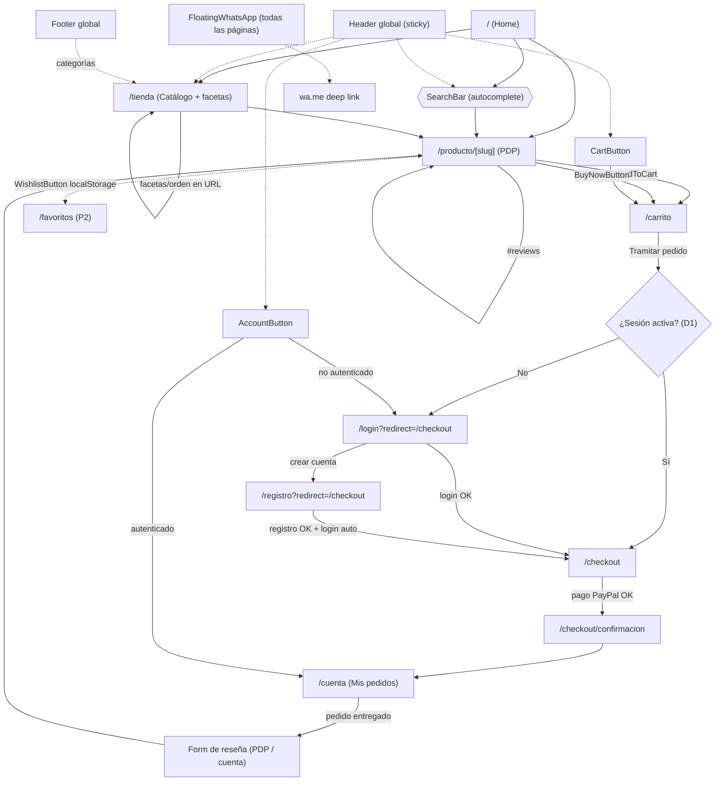
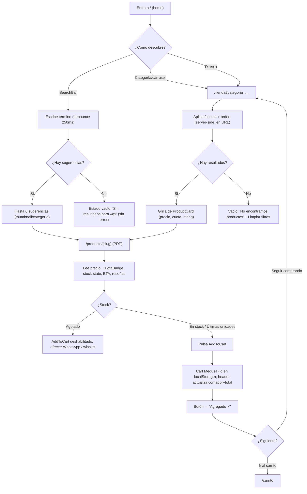
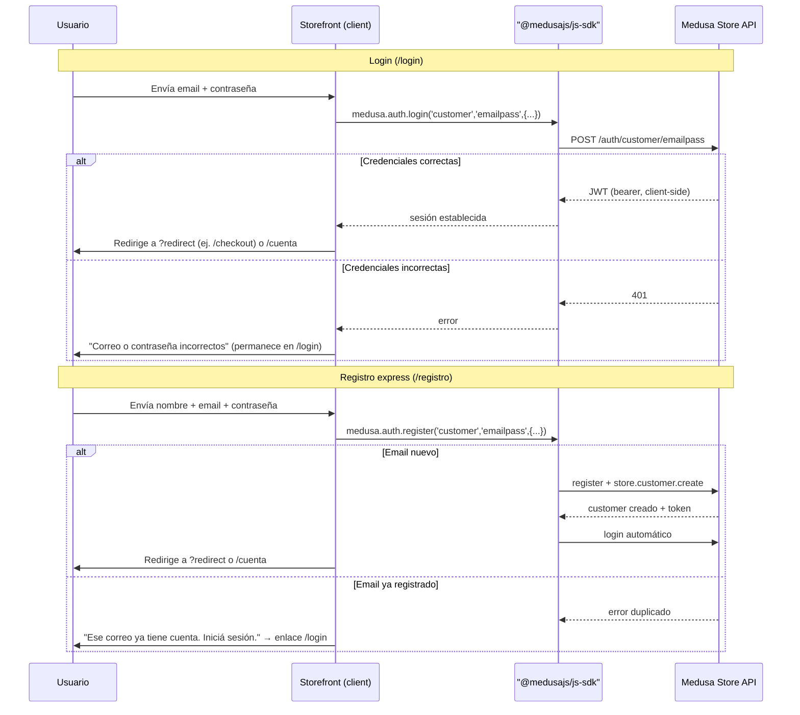
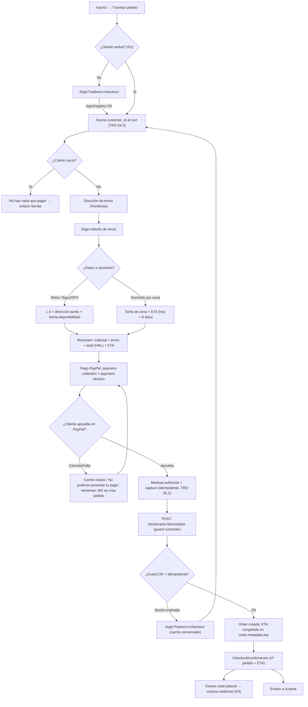
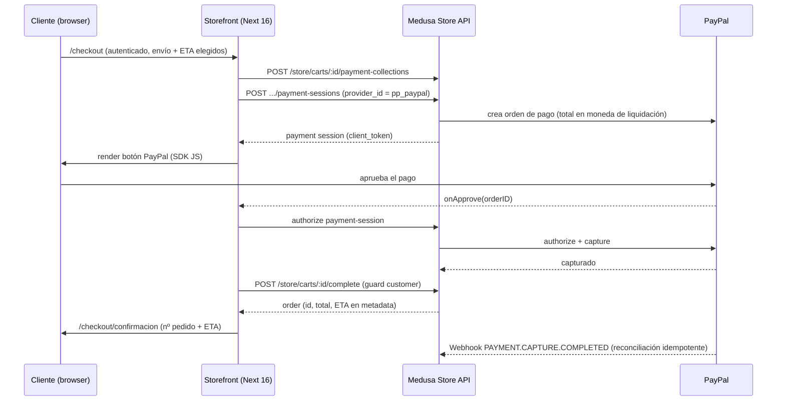
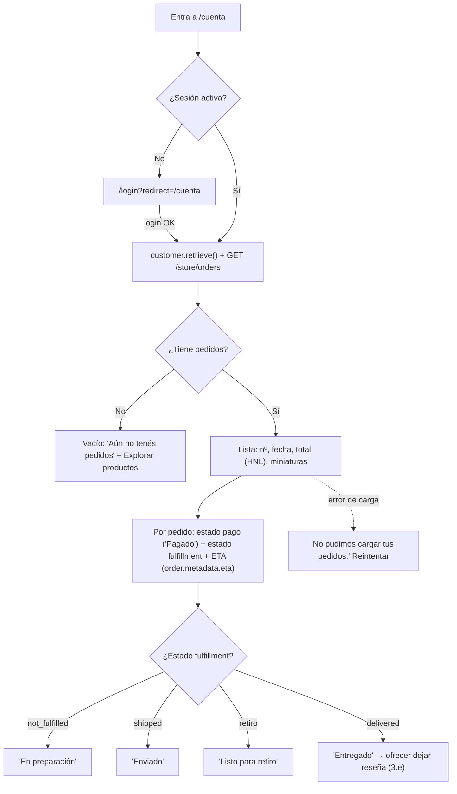
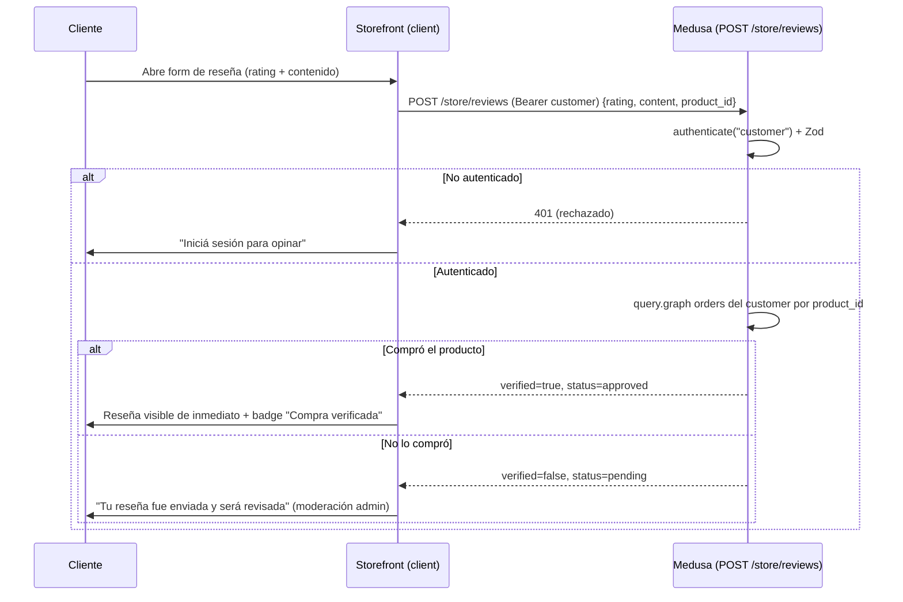
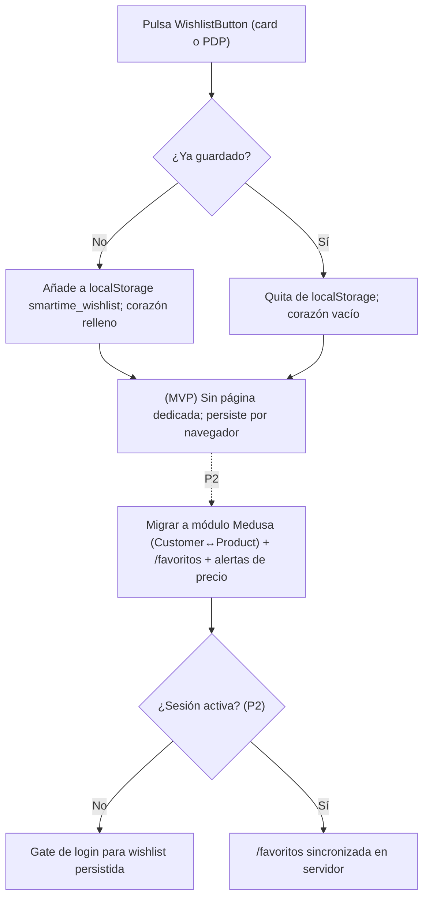
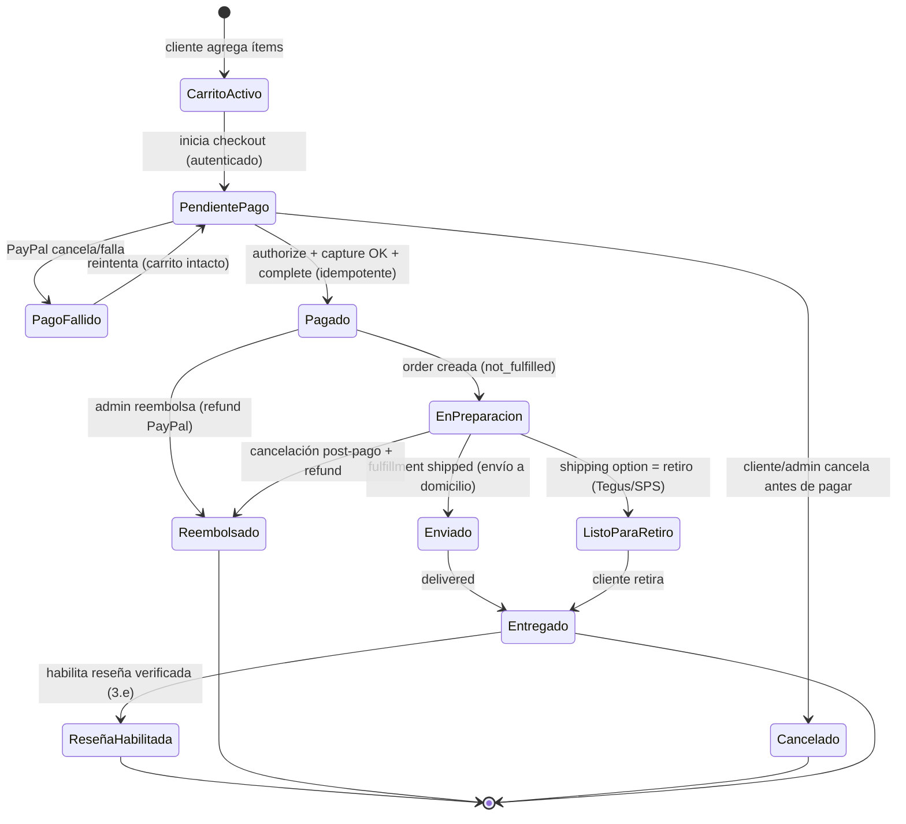

# 04 — App Flow (Recorridos de usuario y máquinas de estado) — smartime

> **Producto:** smartime — tienda online especialista Apple + electrónica de consumo para Honduras (HNL).
> **Stack:** Storefront **Next.js 16** (App Router, RSC, React 19, Tailwind 4, shadcn/ui) ⇄ Backend **Medusa v2.17** (Postgres en Supabase). Dos repos hermanos: `store/` y `medusa/`.
> **Alcance:** mapa del sitio, navegación global, recorridos extremo a extremo, máquina de estados del pedido, reglas de gating/permisos y casos borde.
> **Estado:** Vigente. Fuente de verdad de los flujos de interacción.
> **Fecha:** 2026-06-29.

### Documentos relacionados (cruce de referencias)

| Doc | Cuándo consultarlo |
|---|---|
| **`01-PRD.md`** | Qué RF cumple cada paso del flujo (RF-CHK-01…), personas, decisiones bloqueadas D1–D5 |
| **`02-TRD.md`** | Cómo se implementa cada endpoint/guard del flujo (§3 APIs, §5 PayPal, §6 envíos) |
| **`03-UXUI-system.md`** | Detalle visual/microcopy de cada pantalla y estado (gate de login, estados de stock, ETA) |
| **`04-app-flow.md`** (este) | Recorridos completos y máquina de estados del pedido |
| **`05-schema-db.md`** | Entidades que cambian de estado en cada paso (cart, order, payment, fulfillment, review) |
| **`06-implementation-plan.md`** | Orden de construcción de los flujos aquí descritos |

**Decisiones bloqueadas que gobiernan estos flujos** (de `01-PRD.md §0`): **D1** checkout con cuenta OBLIGATORIA (sin invitado) → gate de login antes del pago; **D2** fulfillment nativo Medusa + retiro en tienda + ETA; **D3** estado de pedido + fecha de entrega en `/cuenta`; **D4** Salesforce solo costura webhook; **D5** superficie de API/webhooks definida.

> Convención de los diagramas: rutas reales del storefront entre comillas (`/tienda`, `/producto/[slug]`); endpoints reales del backend con su método (`POST /store/carts/:id/complete`). Los estados con etiqueta es-HN coinciden con `02-TRD.md §6.3` y `03-UXUI-system.md §10`.

---

## 1. Mapa del sitio / rutas (públicas vs requieren sesión)

Rutas reales bajo `src/app/(frontend)/`. La columna **Acceso** indica el gate: **Pública** (sin sesión), **Requiere sesión** (cliente Medusa autenticado, D1), **Pública con datos de sesión** (la página carga sin login pero una acción dentro exige sesión).

| Ruta | Pantalla | Acceso | Render (TRD §8.2) | Gate / redirección | RF |
|---|---|---|---|---|---|
| `/` | Home (Hero, carruseles, BrandStrip, TrustBand) | **Pública** | `force-dynamic` | — | RF-CAT-03 |
| `/tienda` | Catálogo + facetas (marca/categoría/precio/oferta) + orden | **Pública** | `force-dynamic` | — | RF-CAT-01 |
| `/producto/[slug]` | PDP / buy box (galería, precio, CuotaBadge, stock, ETA, reseñas) | **Pública** | `force-dynamic` | Acciones (reseña) exigen sesión | RF-PDP-01/02/03, RF-REV-02 |
| `/carrito` | Carrito (ítems, qty, subtotal, "Tramitar pedido") | **Pública con datos de sesión** | client | "Tramitar pedido" → `/checkout` (gate allí) | RF-CAR-01 |
| `/checkout` | Checkout (envío + ETA + pago PayPal + confirmación) | **Requiere sesión (D1)** | client | Sin sesión → `/login?redirect=/checkout` | RF-CHK-01/02/03, RF-PAY-01, RF-SHIP-01/02/03 |
| `/checkout/confirmacion` *(a construir P0.1)* | Confirmación de pedido (nº pedido + ETA) | **Requiere sesión** | client | Sin sesión o sin pedido → `/cuenta` o `/tienda` | RF-CHK-03, RF-PAY-01 |
| `/login` | Inicio de sesión (emailpass) | **Pública** | client | Si ya autenticado → `?redirect` o `/cuenta` | RF-AUTH-02 |
| `/registro` | Registro express (correo + contraseña) | **Pública** | client | Tras registro → login auto → `?redirect` o `/cuenta` | RF-AUTH-01 |
| `/cuenta` | Perfil + "Mis pedidos" (estado + ETA) | **Requiere sesión (D3)** | client | Sin sesión → `/login?redirect=/cuenta` | RF-ORD-01/02 |
| `/favoritos` *(P2)* | Wishlist persistida | **Requiere sesión (P2)** | client | Sin sesión → gate; en MVP wishlist es localStorage | RF-WL-01 |
| `/comparar` *(P2)* | Comparador de productos | **Pública** | — | — | P2.3 |
| `/not-found` | 404 custom | **Pública** | estático | — | — |
| `/ie-incompatible.html` | Aviso IE | **Pública** | estático | redirect por user-agent (`redirects.ts`) | — |

**Anclas internas relevantes:** `/producto/[slug]#reviews` (sección de reseñas), modal de cuotas (no es ruta, es overlay sobre la PDP).

**Acciones que exigen sesión aunque la página sea pública:**

| Acción | Página origen | Endpoint backend | Guard |
|---|---|---|---|
| Completar carrito (pagar) | `/checkout` | `POST /store/carts/:id/complete` | `authenticate("customer")` (TRD §3.5) |
| Crear reseña | PDP / `/cuenta` | `POST /store/reviews` | `authenticate("customer")` (TRD §3.5) |
| Ver mis pedidos | `/cuenta` | `GET /store/orders` (customer) *(a construir, TRD §3.4)* | sesión/bearer cliente |
| Ver/editar perfil | `/cuenta` | `GET /store/customers/me` | sesión/bearer cliente |

**Acciones públicas (sin sesión):** navegar catálogo, buscar, ver PDP, agregar al carrito (cart anónimo), wishlist localStorage, abrir modal de cuotas, abrir WhatsApp.

---

## 2. Diagrama de navegación global

**Elementos persistentes en todas las páginas:** Header sticky (Logo, SearchBar, AccountButton, CartButton), Footer, FloatingWhatsApp, AnnouncementBar. El AccountButton bifurca: autenticado → `/cuenta`; no autenticado → `/login`.

---

## 3. Recorridos de usuario (paso a paso)

### 3.a — Descubrir → buscar / facetas → PDP → agregar al carrito

**Persona:** P1/P3/P4. **RF:** RF-CAT-01/02/03, RF-PDP-01/03, RF-CAR-01. **Acceso:** público (sin sesión).

**Pasos:**
1. El usuario entra a `/` (home). RSC sirve Hero + carruseles por categoría (solo `CategoryTile` con `count > 0`) + BrandStrip + TrustBand.
2. Descubre por tres vías: (a) clic en carrusel/categoría → `/tienda?categoria=…`; (b) `SearchBar` con debounce 250 ms → hasta 6 sugerencias → PDP; (c) navegación directa a `/tienda`.
3. En `/tienda` aplica facetas (marca, categoría, rango de precio, "en oferta") y orden (precio asc/desc, rating). Todo server-side; los filtros viven en `searchParams` (URL compartible/recargable). Cada `ProductCard` muestra precio HNL, descuento, `ReviewStars` y `CuotaBadge` compact.
4. Abre una PDP `/producto/[slug]`: galería, precio, `CuotaBadge` full, estado de stock (texto, nunca número crudo — RNF-SEC-07), ETA por ciudad (cookie), reseñas aprobadas.
5. Pulsa `AddToCart` → se crea/usa el cart de Medusa (id en `localStorage smartime_medusa_cart_id`); el contador y total del header se actualizan. El botón pasa a "Agregado ✓".

**Estados/errores:** búsqueda sin resultados (estado vacío, no error); fallo al cargar catálogo ("No pudimos cargar el catálogo. Reintentar."); producto agotado (CTA deshabilitada + alternativa WhatsApp/wishlist); fallo al agregar al carrito ("No pudimos actualizar el carrito.", el carrito previo se conserva).

---

### 3.b — Registro e inicio de sesión

**Persona:** todas. **RF:** RF-AUTH-01 (registro), RF-AUTH-02 (login). **Auth:** Medusa `emailpass` (TRD §4.1). **Acceso:** público; tras éxito se respeta `?redirect`.

**Registro (`/registro`):** `medusa.auth.register('customer','emailpass',{email,password})` + `medusa.store.customer.create(...)` → login automático → redirección a `?redirect` (p. ej. `/checkout`) o `/cuenta`. Correo duplicado → error claro, sin duplicar cuenta.

**Login (`/login`):** `medusa.auth.login('customer','emailpass',{email,password})` → JWT gestionado client-side por el SDK (modo bearer en MVP, TRD §4.1) → redirección a `?redirect` o `/cuenta`. Credenciales incorrectas → error, permanece en `/login`.

**Estados/errores:** validación de campos (correo válido, contraseña mínima) con mensajes accesibles (`aria-describedby`, `aria-invalid`); correo duplicado en registro; credenciales inválidas en login; fallo de red (reintentar sin perder lo escrito).

---

### 3.c — CHECKOUT que EXIGE cuenta (D1): gate → envío/ETA → pago PayPal → confirmación

**Persona:** todas. **RF:** RF-CHK-01/02/03, RF-PAY-01, RF-SHIP-01/02/03. **Decisiones:** D1 (cuenta obligatoria), D2 (fulfillment nativo + retiro + ETA). **Endpoints:** `POST /store/carts/:id/payment-collections` + `payment-sessions`, `POST /store/carts/:id/complete` (guard customer).

**Pasos:**
1. **Gate de autenticación (RF-CHK-01):** desde `/carrito` el usuario pulsa "Tramitar pedido" → `/checkout`. Si NO hay sesión → redirección a `/login?redirect=/checkout` (con opción "Creá tu cuenta" → `/registro?redirect=/checkout`). Microcopy del gate (UX §10.2): *"Iniciá sesión o creá tu cuenta para finalizar la compra. Así podés seguir tu pedido y dejar reseñas."* El guard backend es la última línea de defensa, no la única (TRD §3.5).
2. **Vinculación carrito↔cliente (TRD §4.3):** tras autenticarse, se asocia el `customer_id` al cart anónimo (`cart.update({ customer_id })` o transferencia de carrito) para que `complete` pase el guard y la orden quede ligada al cliente. El carrito queda intacto.
3. **Dirección de envío (RF-CHK-02):** el cliente completa/elige dirección en Honduras.
4. **Método de envío + ETA (RF-SHIP-01/02/03, D2):** elige entre **Retiro en tienda** (Tegus/SPS, L 0) o **envío a domicilio por zona** (Tegucigalpa / SPS / resto del país). Para cada opción se muestra **tarifa + FECHA ESTIMADA** (calculada desde `shipping_option.metadata.min_days/max_days` = `hoy + N días hábiles`, TRD §6.2). La ETA SIEMPRE visible antes de pagar (O9 = 100%).
5. **Resumen:** subtotal, envío, impuestos (si aplican) y total en HNL (todo server-side, Medusa calcula; el front formatea — TRD §1.2/§5.3).
6. **Pago PayPal (RF-PAY-01, TRD §5):** se crea `payment-collection` + `payment-session` (provider `pp_paypal`). El cliente aprueba en el SDK JS de PayPal. Medusa autoriza + captura. **Sin cargos ocultos** (diferenciador vs USD 1 de La Curacao). Moneda: mostrar HNL, liquidar en moneda soportada con tasa transparente (TRD §5.4 Opción A).
7. **Completar pedido (RF-CHK-03):** `POST /store/carts/:id/complete` (guard exige `authenticate("customer")`). El carrito se convierte en `order` ligada al customer; se congela la **ETA absoluta** en `order.metadata.eta` (TRD §6.2).
8. **Confirmación:** `/checkout/confirmacion` muestra nº de pedido + ETA. Se emite `order.placed` → costura webhook (D4, futuro). Desde aquí, enlace a `/cuenta`.

**Secuencia de pago PayPal (detalle, espejo de TRD §5.1):**

**Estados/errores:** carrito vacío ("No hay nada que pagar"); sesión expirada en medio del checkout → re-login con `?redirect`, carrito conservado; pago cancelado/fallido → carrito intacto, sin pedido pagado, reintentar; doble envío del webhook/reintentos → idempotencia (un `cart_id`/`capture_id` no genera dos pedidos, TRD §5.2); stock agotado entre agregar y pagar → ver §6.

---

### 3.d — `/cuenta`: lista de pedidos + detalle con ESTADO y FECHA de envío (D3)

**Persona:** P1/P4/P5. **RF:** RF-ORD-01 (lista), RF-ORD-02 (estado + ETA). **Decisión:** D3. **Endpoint:** `GET /store/orders` (customer autenticado) *(a construir/cablear P0.3, TRD §3.4)*. El storefront es **solo lectura** sobre el estado; el operador lo cambia desde el dashboard (RF-ADM-02).

**Pasos:**
1. El cliente entra a `/cuenta`. Sin sesión → `/login?redirect=/cuenta`.
2. Con sesión, `medusa.store.customer.retrieve()` carga nombre/email; la sección "Mis pedidos" consume `GET /store/orders`.
3. Cada pedido muestra: nº, fecha, total (HNL), miniaturas, **estado de pago** ("Pagado") y **estado de fulfillment** ("En preparación" / "Enviado" / "Listo para retiro" / "Entregado", mapeo TRD §6.3) + **FECHA ESTIMADA** de entrega/retiro (`order.metadata.eta`, congelada — no cambia con el tiempo).
4. Sin pedidos → estado vacío ("Aún no tenés pedidos." + "Explorar productos").
5. Si un pedido está "Entregado", se ofrece dejar reseña (enlace al form, recorrido 3.e).

**Estados/errores:** sin sesión → gate; sin pedidos → vacío con CTA; fallo de carga ("No pudimos cargar tus pedidos."); estado desfasado → el storefront refleja lo último que el admin actualizó (solo lectura).

---

### 3.e — Dejar reseña (solo tras compra verificada)

**Persona:** P1/P5. **RF:** RF-REV-01 (crear), RF-REV-02 (mostrar). **Endpoint:** `POST /store/reviews` (guard customer + Zod, TRD §3.3/§7.2). **Regla:** el backend verifica contra las órdenes del cliente; si compró el producto → `verified=true` + `status='approved'` (aparece de inmediato); si no → `status='pending'` (moderación manual del admin, RF-ADM-01).

**Pasos:**
1. El cliente autenticado abre el form de reseña (desde `/cuenta` en un pedido entregado, o desde la PDP del producto comprado). Visitante no autenticado → el backend rechaza (`authenticate("customer")`).
2. Envía rating (1–5, estrellas interactivas `role="radiogroup"`) + contenido (+ título opcional).
3. `POST /store/reviews` con `customer_id = req.auth_context.actor_id`. El backend hace `query.graph` sobre las órdenes del cliente filtrando por `product_id`.
4. Si encuentra compra → `verified=true` + `approved` → aparece de inmediato con badge "Compra verificada". Si no → `pending` → mensaje "Tu reseña fue enviada y será revisada".

**Estados/errores:** no autenticado → rechazo + invitación a login; validación Zod (contenido vacío, rating fuera de 1–5); reseña duplicada (gestión de UX según política); spam (gap conocido: rate limiting RNF-SEC-06, R4 — moderación de pendientes mitiga).

---

### 3.f — Wishlist

**Persona:** P5. **RF:** RF-WL-01. **MVP:** `localStorage smartime_wishlist` (sin sesión). **P2:** módulo Medusa Customer↔Product + página `/favoritos` + alertas de bajada de precio (requiere sesión).

**Pasos (MVP):**
1. El usuario pulsa `WishlistButton` (corazón) en una `ProductCard` o PDP.
2. El producto se añade/quita de `localStorage smartime_wishlist`; el ícono refleja el estado (relleno = guardado).
3. No requiere sesión; persiste solo en ese navegador/dispositivo.

**Estados/errores (MVP):** wishlist vacía ("Tu lista de deseos está vacía."); pérdida al limpiar localStorage o cambiar de dispositivo (limitación conocida, resuelta en P2 con persistencia server-side).

---

## 4. Máquina de estados del pedido

Estados derivados de Medusa (`order.payment_status` + `order.fulfillment_status`) con etiquetas es-HN (TRD §6.3, UX §10.2). El operador cambia fulfillment desde el dashboard; el storefront es solo lectura (D3, RF-ADM-02). Incluye cancelación y reembolso.

**Mapeo estado interno ↔ etiqueta storefront:**

| Estado interno (Medusa) | Etiqueta es-HN en `/cuenta` | Canal |
|---|---|---|
| cart activo / pago no iniciado | (no es pedido aún) | — |
| `payment_status: awaiting` | "Pago pendiente" | pago |
| `payment_status: captured` | "Pagado" | pago |
| `fulfillment_status: not_fulfilled` | "En preparación" | fulfillment (domicilio o retiro) |
| `fulfillment_status: shipped` | "Enviado" | fulfillment (domicilio) |
| shipping option = retiro, no entregado | "Listo para retiro" | fulfillment (retiro) |
| `fulfillment_status: delivered` | "Entregado" | fulfillment |
| `canceled` | "Cancelado" | pedido |
| `refunded` | "Reembolsado" | pago |

**Reglas de transición clave:** sin `Pagado` no hay `EnPreparacion` (no se prepara lo no cobrado); el reembolso solo tras `Pagado`; `Entregado` es terminal y habilita la reseña verificada; la idempotencia evita pasar dos veces de `PendientePago` a `Pagado` por reintentos/webhook (TRD §5.2).

---

## 5. Reglas de gating / permisos

| Recurso / acción | Quién puede | Mecanismo | Si no cumple |
|---|---|---|---|
| Ver catálogo, búsqueda, PDP, home | Cualquiera (público) | Store API + publishable key (Sales Channel HN) | — |
| Agregar al carrito | Cualquiera (cart anónimo) | `localStorage smartime_medusa_cart_id` | — |
| Wishlist (MVP) | Cualquiera | `localStorage smartime_wishlist` | — |
| Entrar a `/checkout` | Cliente autenticado (D1) | Redirección front `/login?redirect=/checkout` | Gate de login (recorrido 3.c) |
| Completar carrito / pagar | Cliente autenticado | `authenticate("customer")` en `POST /store/carts/:id/complete` (TRD §3.5) | Backend rechaza (última línea) |
| Crear reseña | Cliente autenticado | `authenticate("customer")` en `POST /store/reviews` | Backend rechaza |
| Reseña aparece de inmediato | Cliente que compró el producto | `query.graph` órdenes → `verified+approved` | `pending` (moderación admin) |
| Ver `/cuenta` y pedidos | Cliente autenticado (D3) | Redirección front `/login?redirect=/cuenta` + sesión/bearer | Gate de login |
| Cambiar estado de pedido | Operador/Admin | Admin API / dashboard (no expuesta al storefront) | Storefront es solo lectura |
| Moderar reseñas (approve/reject) | Operador/Admin | Admin API `POST /admin/reviews/:id/approve\|reject` *(a construir, TRD §7.3)* | — |
| Wishlist persistida + alertas | Cliente autenticado (P2) | Módulo Medusa Customer↔Product | Gate de login (P2) |

**Principio (D5):** el storefront solo usa la **Store API pública** (publishable key) y, para acciones sensibles, sesión/bearer del cliente. La **Admin API** queda restringida a operadores y nunca se expone al storefront. CORS sin comodín (`STORE_CORS`/`ADMIN_CORS`/`AUTH_CORS`, TRD §9).

---

## 6. Casos borde y manejo de errores

| # | Caso | Dónde ocurre | Comportamiento esperado | Microcopy / acción | Ref |
|---|---|---|---|---|---|
| E1 | **Pago PayPal falla o se cancela** | `/checkout` paso pago | No se llama a `complete`; carrito intacto; sin pedido pagado; reintentar posible | "No pudimos procesar tu pago. Tu carrito sigue intacto, podés reintentar." | RF-PAY-01, TRD §5.2 |
| E2 | **Sesión expirada en medio del checkout** | `/checkout` | Redirección a `/login?redirect=/checkout`; al volver, carrito y selección de envío conservados | Gate de login (sin perder el carrito) | D1, TRD §4.3 |
| E3 | **Stock agotado entre agregar y pagar** | `/checkout` / `complete` | Medusa rechaza/ajusta la línea; se informa al cliente; ofrecer quitar ítem o WhatsApp | "Una pieza de tu carrito se agotó. Quitala para continuar." | RNF-SEC-07, R5 |
| E4 | **Carrito vacío al entrar a `/checkout`** | `/checkout` | No permite pagar | "No hay nada que pagar." + enlace `/tienda` | RF-CHK-02 |
| E5 | **Doble clic / reintento de pago / webhook duplicado** | `complete` + webhook PayPal | Idempotencia: un `cart_id`/`capture_id` no crea dos pedidos | Silencioso (un solo pedido) | TRD §5.2 |
| E6 | **Falla al cargar pedidos en `/cuenta`** | `/cuenta` | Estado de error con reintento; no rompe la página | "No pudimos cargar tus pedidos." | RF-ORD-01 |
| E7 | **Reseña de quien no compró** | `POST /store/reviews` | Se acepta como `pending` (moderación), no se publica hasta aprobación | "Tu reseña fue enviada y será revisada." | RF-REV-01 |
| E8 | **Reseña de no autenticado** | `POST /store/reviews` | Backend rechaza (401) | "Iniciá sesión para opinar." | RF-REV-01, TRD §3.5 |
| E9 | **Listados vacíos (publishable key sin Sales Channel HN)** | catálogo | Sin productos / 401 | Verificar enlace key↔Sales Channel HN (gotcha) | TRD §1.2 |
| E10 | **`region_id` ausente en llamadas de catálogo** | precios | `calculated_amount` llega 0 | `getRegionId()` (HNL) en toda llamada; precio correcto | TRD §3.2 |
| E11 | **Imagen de CDN externo cae/cambia** | tarjetas/PDP | Skeleton/`bg-muted`; `alt` significativo; no rompe layout | Plan futuro rehospedaje S3 | R6, UX §7.2 |
| E12 | **Búsqueda sin resultados** | SearchBar / `/tienda` | Estado vacío claro, no error | "Sin resultados para «q»." / "No encontramos productos." | RF-CAT-02 |
| E13 | **ETA conservadora errónea** | checkout / `/cuenta` | ETA por rango conservador; retiro como alternativa segura | "Recíbelo entre el {d1} y {d2}" | R3, TRD §6.2 |
| E14 | **Spam de reseñas (sin rate limit)** | `POST /store/reviews` | Gap conocido; mitigación: moderación de `pending` + rate limit futuro | — | RNF-SEC-06, R4 |
| E15 | **Doble pestaña con distinto cart** | carrito | El id en localStorage es la fuente; última operación gana; recalcular al cargar | Sincronizar al montar `/carrito` | RF-CAR-01 |
| E16 | **Cancelación/reembolso post-pago** | `/cuenta` | Admin reembolsa (PayPal refund); estado pasa a "Reembolsado" | Cliente ve "Reembolsado" (solo lectura) | §4 |

**Principio transversal de errores (UX §10):** todo error dice **qué pasó y qué hacer después**; nunca un error sin salida. El carrito y el dinero del cliente nunca quedan en estado ambiguo: ante duda, no se crea pedido pagado y se permite reintentar.

---

### Apéndice — Trazabilidad recorrido ↔ RF ↔ decisión

| Recorrido | RF principales | Decisión bloqueada |
|---|---|---|
| 3.a Descubrir → carrito | RF-CAT-01/02/03, RF-PDP-01/03, RF-CAR-01 | — |
| 3.b Registro / login | RF-AUTH-01/02 | D1 (habilita el gate) |
| 3.c Checkout + PayPal | RF-CHK-01/02/03, RF-PAY-01, RF-SHIP-01/02/03 | D1, D2 |
| 3.d `/cuenta` pedidos | RF-ORD-01/02, RF-ADM-02 | D3 |
| 3.e Reseña verificada | RF-REV-01/02, RF-ADM-01 | — |
| 3.f Wishlist | RF-WL-01 | — (P2 requiere sesión) |
| §4 Máquina de estados | RF-CHK-03, RF-PAY-01, RF-SHIP-02, RF-ORD-02 | D2, D3 |
| §5 Gating | RF-API-01 | D1, D5 |

> Para el *qué*/criterios de aceptación, ver **`01-PRD.md`**. Para el *cómo* técnico, **`02-TRD.md`**. Para el diseño/microcopy, **`03-UXUI-system.md`**. Para el modelo de datos, **`05-schema-db.md`**. Para la ejecución, **`06-implementation-plan.md`**.
