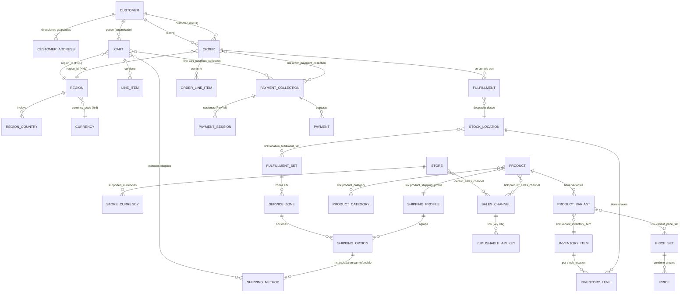
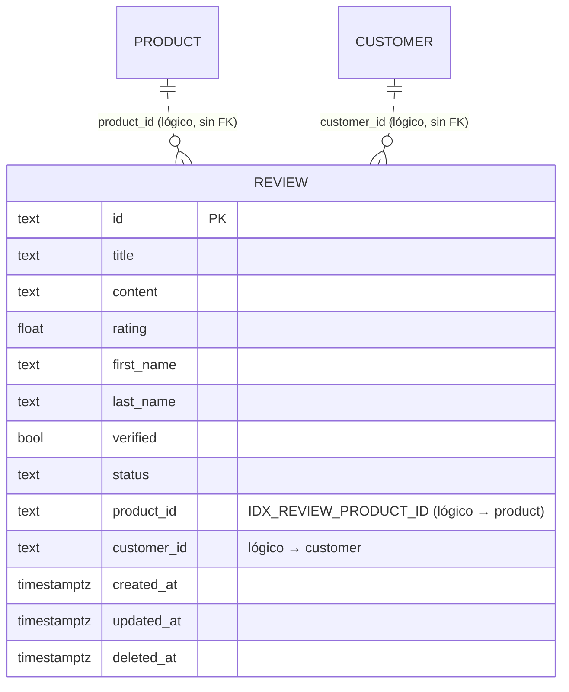
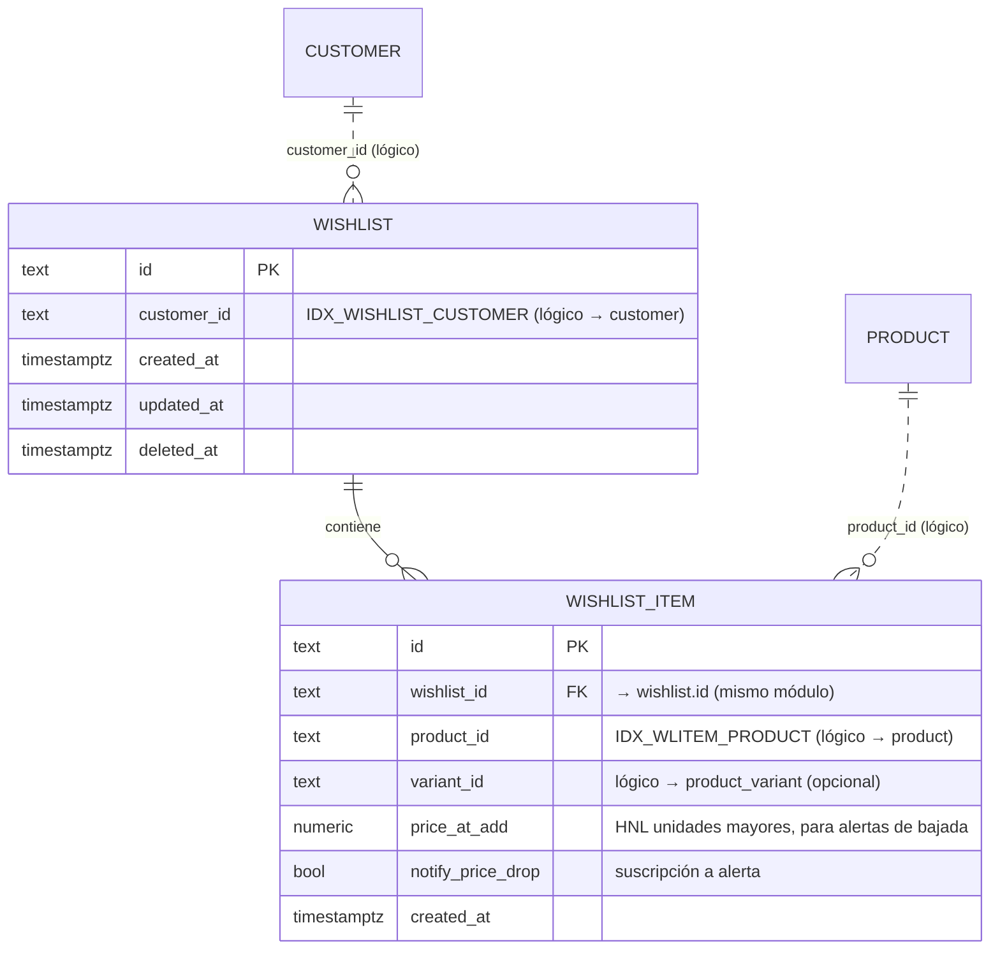

# 05 — Schema de base de datos — smartime

> **Producto:** smartime — storefront headless de Honduras (HNL). Especialista Apple + electrónica de consumo.
> **Stack de datos:** Backend **Medusa v2.17** sobre **Postgres en Supabase** (ORM **MikroORM + Knex**, dialecto Postgres). Conexión por **Session pooler :5432** `?sslmode=require`, TLS verificado con `DATABASE_CA_CERT`. El storefront Next.js **nunca** habla con Postgres: solo consume la Store API.
> **Autor:** Ingeniería de datos.
> **Estado:** Vigente. Documento maestro del modelo de datos. Operacionaliza `01-PRD.md` y `02-TRD.md`.
> **Fecha:** 2026-06-29.

### Documentos relacionados (cruce de referencias)

| Doc | Para qué consultarlo |
|---|---|
| **`01-PRD.md`** | *Qué* y *por qué*: RF (RF-SHIP-01…), decisiones bloqueadas D1–D5, métricas. |
| **`02-TRD.md`** | *Cómo*: arquitectura, APIs, pagos PayPal, envíos nativos, seguridad, despliegue. |
| **`03-UXUI-system.md`** | Detalle visual de pantallas y componentes. |
| **`04-app-flow.md`** | Recorridos extremo a extremo (carrito → checkout → pago → pedido). |
| **`05-schema-db.md`** (este) | Entidades core de Medusa relevantes + módulos custom (review; wishlist propuesto), metadata, precios HNL, datos de envío/ETA, migraciones, índices. |
| **`06-implementation-plan.md`** | Secuencia de entrega por fases. |

> **Decisiones bloqueadas (de `01-PRD.md §0`)** que tocan el modelo de datos: **D1** checkout con cuenta obligatoria (la `order` siempre lleva `customer_id`); **D2** fulfillment nativo Medusa + ETA + retiro en tienda; **D3** estado de pedido + fecha en `/cuenta`; **D4** Salesforce solo costura webhook (no hay tablas CRM); **D5** superficie de API definida. Además: **precios en unidades mayores de HNL** (`amount = 24999` ⇒ `L 24,999`, nunca centavos).

---

## 1. Visión general

### 1.1 Quién define el esquema

El **99 % del esquema lo define Medusa v2**. Cada módulo del framework (Product, Pricing, Inventory, Region/Currency, Sales Channel, Customer, Cart, Order, Fulfillment, Payment, Promotion, Tax) trae su propio conjunto de tablas, generadas y versionadas por **migraciones que viven en `node_modules/@medusajs/**/dist/migrations`**. **No las editamos ni las inventamos**: las consume el CLI de Medusa (`medusa db:migrate`).

smartime **agrega** exactamente un módulo custom hoy — **`product-review`** (tabla `review`) — y este documento **propone** (opcional, P2) un módulo **`wishlist`** para persistir favoritos. Todo lo demás es Medusa nativo.

### 1.2 Principios de modelado (vinculantes)

1. **No tocar las tablas core de Medusa por SQL directo.** Toda mutación pasa por servicios/workflows del framework. El esquema core es un detalle de implementación de Medusa; aquí documentamos **solo los campos relevantes** para smartime (no toda la columna de cada tabla).
2. **Módulos aislados.** En Medusa v2 cada módulo es su propio "bounded context": sus tablas no tienen **foreign keys** hacia otros módulos. Las relaciones entre módulos se resuelven por **Module Links** (tabla de enlace generada) o, en módulos custom simples como `review`, por una **referencia lógica** (`product_id` como `text`, sin FK). Esto es intencional y hay que respetarlo.
3. **Precios server-side, en unidades mayores de HNL.** El cálculo lo hace el Pricing/Cart Module; el front solo formatea (ver §5).
4. **`metadata` (JSONB) para extensiones ligeras.** `product.metadata.brand`, `product.metadata.compare_at_price`, `shipping_option.metadata.{min_days,max_days}`, `order.metadata.eta` (ver §4 y §6) — evita migraciones para datos auxiliares.
5. **La `order` siempre ligada a un `customer`** (D1: sin guest checkout).

### 1.3 Convención de notación de las tablas

En las tablas de campos de este documento:
- **Solo se listan los campos relevantes** para smartime (Medusa define más columnas; no las inventamos ni las recitamos todas).
- **PK** = clave primaria; **FK** = foreign key real (solo dentro del mismo módulo); **link** = relación vía Module Link (tabla puente); **lógica** = referencia por id sin FK (módulos aislados).
- Los ids de Medusa son **text** con prefijo (`prod_…`, `variant_…`, `cart_…`, `order_…`, `cus_…`, `reg_…`).

---

## 2. ERD de las entidades CORE relevantes

> Diagrama lógico. Las líneas entre **módulos distintos** son **Module Links** (no FK físicas); las líneas dentro de un mismo módulo son FK reales. Se omiten columnas no relevantes para smartime.



### 2.1 Catálogo: `product`, `product_variant`, `product_category`

**`product`** (Product Module — tabla `product`)

| Campo | Tipo | Relevancia para smartime |
|---|---|---|
| `id` | text PK (`prod_…`) | Identificador; referenciado **lógicamente** por `review.product_id`. |
| `title` | text | `ViewProduct.title`, h1 de la PDP. |
| `handle` | text (único) | Slug → ruta `/producto/[handle]`. `getProductByHandle`. |
| `subtitle` | text? | Opcional. |
| `description` | text? | Descripción de PDP. |
| `status` | enum (`draft`/`proposed`/`published`/`rejected`) | Solo `published` se sirve al storefront. |
| `thumbnail` | text? (URL) | Imagen principal (`ViewProduct.image`); CDN externo verbatim. |
| `metadata` | jsonb? | **`brand` y `compare_at_price`** (ver §4). |
| `created_at`/`updated_at`/`deleted_at` | timestamptz | Soft-delete estándar de Medusa. |

**`product_variant`** (tabla `product_variant`)

| Campo | Tipo | Relevancia |
|---|---|---|
| `id` | text PK (`variant_…`) | `ViewProduct.variantId`; es el id que se agrega al carrito (`createLineItem`). |
| `product_id` | text FK → `product.id` | FK **real** (mismo módulo). |
| `title` | text | Nombre de variante (p. ej. "256 GB · Medianoche"). |
| `sku` | text? | SKU del seed. |
| `manage_inventory` | bool | Si `true`, el stock se controla por `inventory_item` (ver §2.4). |
| `metadata` | jsonb? | Facetas Apple futuras (chip/almacenamiento/color) — P1. |

> El **precio** NO está en `product_variant`: vive en el **Pricing Module** (`price_set` → `price`), enlazado por Module Link (ver §2.3). El **inventario** tampoco: vive en el Inventory Module (ver §2.4).

**`product_category`** (tabla `product_category`)

| Campo | Tipo | Relevancia |
|---|---|---|
| `id` | text PK (`pcat_…`) | Categoría. |
| `name` | text | "Tablets y wearables", etc. (8 categorías). |
| `handle` | text | Filtro `/tienda?categoria=`. |
| `is_active` | bool | Solo activas se muestran (`CategoryGrid` filtra además `count > 0`). |
| `parent_category_id` | text? FK (self) | Jerarquía opcional. |

Relación `product ↔ product_category` es **muchos-a-muchos** vía Module Link (`product_category_product`).

### 2.2 Región y moneda: `region`, `currency`, `store`, `sales_channel`

**`region`** (Region Module — tabla `region`)

| Campo | Tipo | Relevancia |
|---|---|---|
| `id` | text PK (`reg_…`) | Región **Honduras**. `getRegionId()` la resuelve por `currency_code='hnl'`; cacheada con `React.cache`. |
| `name` | text | "Honduras". |
| `currency_code` | text FK → `currency.code` | **`hnl`**. Imprescindible para que `calculated_price` venga poblado. |
| `metadata` | jsonb? | Reservado. |

**`region_country`** — países de la región (Honduras → `hn`).

**`currency`** (tabla `currency`)

| Campo | Tipo | Relevancia |
|---|---|---|
| `code` | text PK | `hnl`. |
| `symbol` / `symbol_native` | text | `L`. |
| `decimal_digits` | int | **0** para HNL en este proyecto (sin centavos). Refuerza §5. |

**`store`** (tabla `store` + `store_currency`) — `supported_currencies` incluye `hnl` (default) y enlaza el **default_sales_channel**.

**`sales_channel`** (tabla `sales_channel`)

| Campo | Tipo | Relevancia |
|---|---|---|
| `id` | text PK (`sc_…`) | **Sales Channel HN**. |
| `name` | text | Canal del storefront. |

> **Gotcha crítico (D5 / `02-TRD.md §1.2`):** la **publishable API key** (`NEXT_PUBLIC_MEDUSA_PUBLISHABLE_KEY`) debe estar **enlazada al Sales Channel HN** (tabla puente `publishable_api_key_sales_channel`). Sin ese enlace, `product.list` devuelve **vacío** o `401`.

### 2.3 Precios: `price_set` y `price` (Pricing Module)

El precio de una variante se modela así: `product_variant —(link variant_price_set)→ price_set —1:N→ price`.

**`price_set`** (tabla `price_set`) — agrupador de precios de una variante; `id` (`pset_…`).

**`price`** (tabla `price`)

| Campo | Tipo | Relevancia |
|---|---|---|
| `id` | text PK | Una fila por (moneda × regla). |
| `price_set_id` | text FK → `price_set.id` | FK real (mismo módulo). |
| `currency_code` | text | `hnl`. |
| `amount` | numeric | **Unidades mayores de HNL** (`24999` = L 24,999). Ver §5. |
| `min_quantity`/`max_quantity` | int? | Precios por volumen (no usado hoy). |
| `rules` | (price_rule) | Reglas (p. ej. por región). |

En la Store API, el front pide `*variants.calculated_price` con `region_id` (HNL) y recibe `calculated_amount` (precio efectivo) y `original_amount` (precio "antes"). `toViewProduct` mapea: `price = calculated_amount`; `originalPrice = (original_amount, si > price) ?? (metadata.compare_at_price, si > price) ?? null` — es decir, el `original_amount` del Pricing **tiene prioridad** sobre `metadata.compare_at_price` (ver §4).

### 2.4 Inventario: `inventory_item`, `inventory_level`, `stock_location`

| Tabla | Campo relevante | Notas |
|---|---|---|
| `inventory_item` | `id` (`iitem_…`), `sku` | Enlazado a la variante por Module Link `variant_inventory_item`. |
| `inventory_level` | `inventory_item_id`, `location_id`, `stocked_quantity`, `reserved_quantity` | Stock por **stock_location**. El seed crea 100 unidades por SKU. |
| `stock_location` | `id` (`sloc_…`), `name`, `address` | **Tegucigalpa** y **San Pedro Sula** (ver §6). |

> **PENDIENTE (gap actual):** hoy `toViewProduct` **no lee inventario**: `ViewProduct.inStock` está **hardcodeado a `true`**. No hay lectura de `inventory_level` ni mapeo a estados de stock variables. El estado de stock real (`En stock` / `Últimas unidades` / `Agotado`) se implementará en una **fase futura (sugerido Fase 2/3)**, leyendo `inventory_level.stocked_quantity` server-side.
>
> **RNF-SEC-07 / R5 (objetivo de diseño cuando se implemente):** el storefront **nunca** debe recibir `stocked_quantity` crudo. El servidor lo mapeará a estado (`En stock` / `Últimas unidades` / `Agotado`) → `ViewProduct.inStock`. No exponer cantidad cruda (error de Jetstereo).

### 2.5 Cliente: `customer`, `customer_address`

**`customer`** (Customer Module — tabla `customer`)

| Campo | Tipo | Relevancia |
|---|---|---|
| `id` | text PK (`cus_…`) | Referenciado **lógicamente** por `review.customer_id` y `order.customer_id`. |
| `email` | text (único por cuenta) | Login emailpass. |
| `first_name`/`last_name` | text? | Mostrados en `/cuenta`. |
| `has_account` | bool | `true` para clientes registrados (D1). |
| `metadata` | jsonb? | Reservado (p. ej. ciudad preferida futura). |

> La **autenticación** (password hash, providers) vive en el **Auth Module** (`auth_identity`, `provider_identity`), separado del `customer`. El front usa `medusa.auth.login/register('customer','emailpass',…)`; el JWT lo gestiona el SDK client-side (`02-TRD.md §4`).

**`customer_address`** (tabla `customer_address`) — direcciones guardadas (`address_1`, `city`, `province`, `country_code='hn'`, `phone`). Usadas en checkout y editables en perfil (gap actual, ver `01-PRD.md` gaps).

### 2.6 Carrito: `cart`, `line_item`

**`cart`** (Cart Module — tabla `cart`)

| Campo | Tipo | Relevancia |
|---|---|---|
| `id` | text PK (`cart_…`) | Guardado en `localStorage` (`smartime_medusa_cart_id`). |
| `region_id` | text → `region.id` (HNL) | Imprescindible para precios calculados. |
| `customer_id` | text? → `customer.id` | Se asocia al iniciar sesión en checkout (`02-TRD.md §4.3`). |
| `email` | text? | Correo del cliente. |
| `currency_code` | text | `hnl`. |
| `completed_at` | timestamptz? | Se setea al convertir en `order`. |
| `metadata` | jsonb? | Reservado. |

**`line_item`** (tabla `cart_line_item`)

| Campo | Tipo | Relevancia |
|---|---|---|
| `id` | text PK | Línea de carrito. |
| `cart_id` | text FK → `cart.id` | FK real. |
| `variant_id` | text (lógico → product_variant) | Variante agregada. |
| `product_id`/`product_title`/`thumbnail` | text | Snapshot del producto. |
| `quantity` | int | Cantidad (`+/-` en `/carrito`). |
| `unit_price` | numeric | Precio HNL congelado al agregar. |

> Totales (`subtotal`, `shipping_total`, `tax_total`, `total`) son **calculados por Medusa**, no columnas de confianza desde el front (`02-TRD.md §5.3`).

### 2.7 Pedido: `order`, `order_line_item`

**`order`** (Order Module — tabla `order`)

| Campo | Tipo | Relevancia |
|---|---|---|
| `id` | text PK (`order_…`) | Número de pedido mostrado en confirmación y `/cuenta`. |
| `display_id` | int (secuencial) | Número legible para el cliente. |
| `customer_id` | text → `customer.id` | **Siempre presente (D1).** Filtro de `GET /store/orders` y de reseñas verificadas. |
| `region_id` | text → `region.id` | HNL. |
| `email` | text | Correo. |
| `currency_code` | text | `hnl`. |
| `payment_status` | enum | "Pagado" en `/cuenta` (RF-ORD-02). |
| `fulfillment_status` | enum | Mapeado a etiqueta es-HN (ver §6.3). |
| `metadata` | jsonb? | **`eta` congelada** y tasa de cambio PayPal (ver §4, §6). |
| `created_at` | timestamptz | Fecha del pedido. |

**`order_line_item`** (tabla `order_line_item`) — análoga a `cart_line_item`, con `product_id` (clave para verificar compra en reseñas: `query.graph` filtra `order.items.product_id`).

### 2.8 Pago: `payment_collection`, `payment_session`, `payment`

| Tabla | Campo relevante | Notas |
|---|---|---|
| `payment_collection` | `id` (`paycol_…`), `amount`, `currency_code`, `status` | Una por carrito/pedido; enlazada por Module Link. |
| `payment_session` | `id`, `provider_id` (`pp_paypal_…`), `data` (jsonb), `status` | Sesión PayPal; `data` lleva el token/approval del SDK PayPal. |
| `payment` | `id` (`pay_…`), `amount`, `captured_at`, `provider_id` | Captura del pago (idempotente, `02-TRD.md §5.2`). |

> PayPal es **Payment Provider** del Payment Module (`02-TRD.md §5`). La **moneda de liquidación** (Opción A del TRD: mostrar HNL, liquidar en moneda soportada) se registra en `order.metadata` (tasa usada) para trazabilidad.

### 2.9 Envío / Fulfillment: `fulfillment_set`, `service_zone`, `shipping_option`, `shipping_profile`, `shipping_method`, `fulfillment`

Detalle en **§6**. Resumen de relaciones:
- `stock_location —(link)→ fulfillment_set —1:N→ service_zone —1:N→ shipping_option`.
- `shipping_profile —1:N→ shipping_option` (un perfil por defecto cubre los ~26 productos; `product —(link)→ shipping_profile`).
- En checkout, elegir una opción crea un `shipping_method` en el `cart`; al completar pasa al `order`.
- El despacho real se registra en `fulfillment` (ligado a `order` y a `stock_location`).

---

## 3. Módulo CUSTOM `review`

### 3.1 Definición real (verificada en `medusa/src/modules/product-review/models/review.ts`)

```ts
const Review = model.define("review", {
  id: model.id().primaryKey(),
  title: model.text().nullable(),
  content: model.text(),
  rating: model.float(),                       // CHECK 1..5
  first_name: model.text(),
  last_name: model.text().nullable(),
  verified: model.boolean().default(false),    // compró el producto (orden real)
  status: model.enum(["pending","approved","rejected"]).default("pending"),
  product_id: model.text().index("IDX_REVIEW_PRODUCT_ID"),
  customer_id: model.text().nullable(),
}).checks([
  { name: "rating_range",
    expression: (c) => `${c.rating} >= 1 AND ${c.rating} <= 5` },
])
```

### 3.2 Tabla `review`

| Campo | Tipo Postgres | Restricción | Descripción |
|---|---|---|---|
| `id` | text | **PK** | Generado por Medusa. |
| `title` | text | NULL | Título opcional de la reseña. |
| `content` | text | NOT NULL | Cuerpo (Zod `min(1)`). |
| `rating` | double precision (float) | **CHECK `rating_range`** (1 ≤ rating ≤ 5) | Estrellas. |
| `first_name` | text | NOT NULL | Nombre mostrado. |
| `last_name` | text | NULL | Apellido opcional. |
| `verified` | boolean | NOT NULL, **default false** | `true` solo si el cliente compró el producto. |
| `status` | text (enum) | NOT NULL, **default `pending`** | `pending` / `approved` / `rejected`. Solo `approved` se sirve al storefront. |
| `product_id` | text | **INDEX `IDX_REVIEW_PRODUCT_ID`** | Referencia **lógica** a `product.id` (sin FK, módulo aislado). |
| `customer_id` | text | NULL | Referencia **lógica** a `customer.id` (autor). |
| `created_at` | timestamptz | NOT NULL, default now | Orden `desc` en el GET público. |
| `updated_at` | timestamptz | NOT NULL | Estándar Medusa. |
| `deleted_at` | timestamptz | NULL | Soft-delete (rollback del workflow `deleteReviews`). |

### 3.3 ERD del módulo review y sus relaciones lógicas



Las líneas son **punteadas** a propósito: **no hay foreign keys físicas** porque `review` es un módulo aislado de `product` (Product Module) y `customer` (Customer Module). La integridad referencial product↔review se resuelve en el **workflow** `create-review.ts` (valida que el `product_id` existe con `throwIfKeyNotFound`), no en la base de datos.

### 3.4 Lógica de `verified` / `status` (verificada en `route.ts`)

`POST /store/reviews` (guard `authenticate("customer")` + Zod):
1. `customer_id = req.auth_context.actor_id`.
2. `query.graph({ entity:"order", fields:["id","items.product_id"], filters:{ customer_id } })`.
3. Si alguna orden del cliente contiene `input.product_id` → `verified = true`, `status = "approved"` (visible al instante).
4. Si no → `status = "pending"` (moderación manual del operador, RF-ADM-01).

El servicio `ProductReviewModuleService.getAverageRating(productId)` y `getSummaries(productIds[])` **solo cuentan `status='approved'`** — alimentan `GET /store/products/:id/reviews` y `GET /store/review-summary`.

---

## 4. Uso de `metadata`

Medusa expone `metadata` (columna **JSONB**) en casi todas las entidades. smartime lo usa para extensiones ligeras que **no justifican una migración** ni una columna tipada, manteniendo el esquema core intacto.

| Entidad | Clave de metadata | Tipo | Para qué | Quién la lee |
|---|---|---|---|---|
| `product` | `metadata.brand` | string | Marca ("Apple", "Samsung", "LG"…). Faceta de marca en `/tienda`, label en `ProductCard`, `ViewProduct.brand`. | `toViewProduct`, facetas. |
| `product` | `metadata.compare_at_price` | number (HNL, unidades mayores) | Precio "antes" para ofertas, como **fallback** cuando el Pricing no aporta `original_amount`. `toViewProduct` da prioridad al `original_amount` del Pricing y solo usa `compare_at_price` (si > price) cuando aquel no existe. | `ProductCard`, PDP (% descuento). |
| `shipping_option` | `metadata.min_days` / `metadata.max_days` | int | Rango de ETA por zona (Tegus `{1,2}`, SPS `{1,2}`, resto `{3,5}`, retiro `{0,1}`). El front calcula la fecha real. | Buy box, checkout (§6.2). |
| `order` | `metadata.eta` | objeto (fechas absolutas) | **ETA congelada** al completar el pedido, para que `/cuenta` muestre siempre la misma fecha (RF-ORD-02). | `/cuenta`. |
| `order` | `metadata.paypal_fx` | objeto `{rate, settle_currency, settle_amount}` | Tasa HNL→moneda de liquidación usada por PayPal (Opción A, `02-TRD.md §5.4`) para trazabilidad contable. | Reconciliación. |
| `product_variant` | `metadata.*` (P1) | string | Facetas Apple (chip/almacenamiento/color) si no se modelan como opciones de variante. | Facetas P1. |

**Por qué metadata y no columnas:** (1) evita modificar/migrar tablas core de Medusa; (2) el dato es auxiliar a la UI/negocio, no a la lógica transaccional del módulo; (3) JSONB es indexable si hiciera falta (GIN). **Riesgo conocido / gap:** `brand` y `compare_at_price` **no están validados** por esquema (no hay JSON Schema en el modelo); un seed mal escrito puede meter tipos incorrectos. **Recomendación:** validar al sembrar (los scripts `seed-*.ts` ya escriben estos valores de forma consistente) y, si escala, considerar promover `brand` a una entidad/atributo tipado.

---

## 5. Precios en HNL (unidades mayores)

**Regla absoluta (D del proyecto / `RNF-I18N-03` / `02-TRD.md §1.2`):** el campo `amount` en `price` y los `*_price`/`*_amount` de carrito/pedido están en **unidades mayores de HNL, sin centavos**. `amount = 24999` ⇒ se muestra **`L 24,999`**. **Nunca** se divide entre 100.

- **Soporte en el modelo:** `currency.decimal_digits = 0` para HNL en este proyecto refuerza que no hay minor units; el formateo lo confirma `Intl.NumberFormat('es-HN',{ currency:'HNL', minimumFractionDigits:0 })` → `L 32,999` (`src/utilities/format.ts`).
- **Flujo:** Pricing calcula → Cart/Order acumula totales → Store API entrega `calculated_amount` (entero HNL) → front **solo formatea**. El `CuotaBadge` divide el precio ya calculado por el número de meses (3/6/12), nunca define precios (`MIN_FINANCING_AMOUNT = 3000`).
- **Implicación para PayPal:** si la moneda de liquidación no es HNL (Opción A, `02-TRD.md §5.4`), la conversión HNL→moneda soportada se hace en el Payment Module server-side y la tasa se guarda en `order.metadata.paypal_fx`. El total mostrado al cliente sigue en HNL entero.
- **Cuidado en `compare_at_price`:** también en unidades mayores (un seed que ponga `2499900` produciría "L 2,499,900" — error de centavos).

---

## 6. Datos para ENVÍOS (Fulfillment nativo — D2) y FECHA ESTIMADA (ETA)

> **A construir en P0.2** (no existe aún; los scripts seed no crean shipping options — ver gaps). Detalle de implementación en `02-TRD.md §6`.
>
> **OJO con `medusa/src/migration-scripts/initial-data-seed.ts`:** es boilerplate **demo de Medusa para EUROPA** (EUR/USD, "European Warehouse", "Standard/Express Shipping") que crea stock locations, fulfillment set, service zones y shipping options **que NO sirven para Honduras**. **Debe ignorarse o reemplazarse** por la configuración HN descrita abajo; no tomarlo como referencia al implementar los envíos.

### 6.1 Entidades y configuración smartime

| Entidad Medusa | Tabla | Configuración smartime |
|---|---|---|
| **Stock Location** | `stock_location` | `Tegucigalpa`, `San Pedro Sula` (bodega/puntos físicos). |
| **Fulfillment Set** | `fulfillment_set` | Set de envío manual (sin outsourcing); enlazado a las stock locations. |
| **Service Zone** | `service_zone` | `Tegucigalpa`, `San Pedro Sula`, `Resto del país`. Geo-condiciones por país/provincia HN. |
| **Shipping Profile** | `shipping_profile` | Perfil **por defecto** que cubre los ~26 productos (`product —link→ shipping_profile`). |
| **Shipping Option** | `shipping_option` | (1) **Retiro en tienda** Tegus/SPS → `price_type: flat`, **L 0**; (2) **Envío Tegucigalpa**; (3) **Envío SPS**; (4) **Envío resto del país** → tarifas planas por zona. Envío gratis sobre umbral = **Promotion Module** (P1.5), no una opción nueva. |
| **Shipping Method** | `cart_shipping_method` / `order_shipping_method` | Instancia de la opción elegida en el carrito; se congela en el pedido. |
| **Fulfillment** | `fulfillment` | Registro de despacho (provider manual), ligado a `order` y `stock_location`. |

**`shipping_option`** (campos relevantes)

| Campo | Tipo | Relevancia |
|---|---|---|
| `id` | text PK (`so_…`) | Identifica la opción. |
| `name` | text | "Retiro en tienda (Tegucigalpa)", "Envío SPS", etc. |
| `service_zone_id` | text FK → `service_zone.id` | Zona a la que aplica (FK real, mismo módulo). |
| `shipping_profile_id` | text FK → `shipping_profile.id` | Perfil. |
| `provider_id` | text | Provider de fulfillment **manual**. |
| `price_type` | enum (`flat`/`calculated`) | `flat` para todas las de smartime en MVP. |
| `metadata` | jsonb | **`{ min_days, max_days }`** → base del cálculo de ETA (§6.2). |

El **precio** de la opción vive en el Pricing Module (otro `price_set`/`price` para `shipping_option`, en HNL unidades mayores), igual que las variantes.

### 6.2 Dónde guardar / computar la FECHA ESTIMADA (ETA) — O9 = 100 %

Medusa **no tiene** un campo nativo de ETA en `shipping_option`. **Decisión de diseño (recomendada, = `02-TRD.md §6.2` Opción A):**

1. **Fuente de verdad del rango:** `shipping_option.metadata = { min_days, max_days }` (días hábiles). Configurable por el operador sin migraciones. Valores propuestos:

   | Opción | min_days | max_days |
   |---|---|---|
   | Retiro en tienda (Tegus/SPS) | 0 | 1 |
   | Envío Tegucigalpa | 1 | 2 |
   | Envío San Pedro Sula | 1 | 2 |
   | Envío resto del país | 3 | 5 |

2. **Cómo se computa la fecha real:** el storefront (o una ruta custom que enriquezca el payload) calcula `fecha = hoy + N días hábiles` a partir de `min_days`/`max_days` y la formatea en es-HN ("Llega entre el 2 y el 4 de julio").
   - **PDP / buy box (RF-PDP-03):** lee la ciudad (cookie) → muestra el rango de su zona.
   - **Checkout (RF-SHIP-03):** al elegir la opción, el resumen muestra **tarifa + ETA** antes de pagar (O9 = 100 %).

3. **Congelar la ETA en el pedido:** al completar (`/store/carts/:id/complete`), se escribe la **ETA absoluta** en **`order.metadata.eta`** (fechas concretas, no el rango relativo), para que `/cuenta` muestre **siempre la misma fecha** (RF-ORD-02) aunque pase el tiempo.

> **Alternativa descartada (Opción B del TRD):** servicio de ETA dinámico con festivos HN/capacidad → sobreingeniería para el MVP.

### 6.3 Estados de fulfillment expuestos en `/cuenta` (D3)

El operador cambia el estado en el dashboard de Medusa; el storefront es **solo lectura** sobre `order.fulfillment_status` (+ detección de "opción = retiro"):

| Estado Medusa (fulfillment) | Etiqueta storefront es-HN |
|---|---|
| `not_fulfilled` / pendiente | "En preparación" |
| `fulfilled` / `shipped` | "Enviado" |
| (shipping option = retiro) | "Listo para retiro" |
| `delivered` | "Entregado" |

El **pago** (`order.payment_status`) se muestra aparte ("Pagado"). Consumido por `GET /store/orders` (nativo, filtra por customer autenticado) o ruta custom que añada la ETA derivada (`02-TRD.md §3.4`).

---

## 7. Wishlist

### 7.1 Realidad actual: **localStorage** (sin base de datos)

Hoy la wishlist **no toca Postgres**. Vive 100 % en el cliente:
- **Provider:** `WishlistProvider` (`src/providers/Wishlist/index.tsx`).
- **Storage:** `localStorage` clave **`smartime_wishlist`** (array de ids de producto).
- **UI:** `WishlistButton` flotante en `ProductCard` y PDP; alterna estado guardado/no guardado.
- **Limitaciones:** no persiste entre dispositivos ni sobrevive a limpiar el navegador; no hay página `/favoritos` ni link en header; no permite alertas de bajada de precio (no hay dónde guardar la suscripción).

Esto es **intencional para el MVP** (`01-PRD.md` RF-WL-01, fuera de alcance §11: "Wishlist persistida en servidor + alertas de precio → P2").

### 7.2 Propuesta (OPCIONAL, P2): módulo `wishlist` en BD

Si se decide persistir favoritos por cliente (necesario para sincronización multi-dispositivo y alertas de precio), se crea un **módulo custom `wishlist`** (mismo patrón que `product-review`: módulo aislado, referencias **lógicas** por id, sin FK cross-módulo).



**Tablas propuestas:**

| Tabla | Campo | Tipo | Notas |
|---|---|---|---|
| `wishlist` | `id` | text PK | Una por cliente (o varias listas, futuro). |
| | `customer_id` | text, **INDEX `IDX_WISHLIST_CUSTOMER`** | Lógico → `customer`. |
| `wishlist_item` | `id` | text PK | Ítem. |
| | `wishlist_id` | text FK → `wishlist.id` | FK real (mismo módulo). |
| | `product_id` | text, **INDEX `IDX_WLITEM_PRODUCT`** | Lógico → `product`. |
| | `variant_id` | text? | Lógico → `product_variant` (opcional). |
| | `price_at_add` | numeric (HNL) | Para detectar bajadas de precio (alerta P2.1). |
| | `notify_price_drop` | bool | Suscripción a alerta. |

**API propuesta:** `GET/POST/DELETE /store/customers/me/wishlist` (auth customer), análoga a reseñas. **Migración** opcional desde localStorage: al primer login con `smartime_wishlist` poblado, hacer merge al servidor y limpiar el local.

**Recomendación:** mantener localStorage en P0/P1; construir el módulo solo cuando se aborde **P2.1** (wishlist completa + alertas + página `/favoritos`). No es bloqueante para el MVP.

---

## 8. Migraciones

### 8.1 Ubicación

| Origen | Ubicación | Editable |
|---|---|---|
| **Core Medusa** | `medusa/node_modules/@medusajs/**/dist/migrations` | ❌ NO. Las gestiona el framework. |
| **Módulo custom `product-review`** | `medusa/src/modules/product-review/migrations/Migration20260629060707.ts` | ✅ Nuestra (crea tabla `review` + índice `IDX_REVIEW_PRODUCT_ID` + CHECK `rating_range`). |
| **Módulo `wishlist`** (si se construye, P2) | `medusa/src/modules/wishlist/migrations/` | ✅ Futura. |

### 8.2 Comandos (desde `medusa/`)

```bash
# Generar migración a partir de cambios en los modelos de un módulo custom
npx medusa db:generate product-review     # o: wishlist (futuro)

# Aplicar TODAS las migraciones pendientes (core + custom) a Postgres
npx medusa db:migrate
```

> **Gotcha de conexión (R8 / `02-TRD.md §2.2`, §9):** `db:migrate` debe correr contra el **Session pooler :5432** `?sslmode=require`. El **Transaction pooler :6543 ROMPE** las migraciones (prepared statements). En producción, además, `DATABASE_CA_CERT` para TLS verificado.

### 8.3 Flujo de cambio de esquema custom

1. Editar el modelo (`models/*.ts`) del módulo custom.
2. `npx medusa db:generate <módulo>` → crea un nuevo archivo `MigrationYYYYMMDDHHMMSS.ts` en `src/modules/<módulo>/migrations/`.
3. Revisar el SQL generado (índices, checks, defaults).
4. `npx medusa db:migrate` para aplicar.
5. Confirmar en repo (`medusa/` es repo git propio).

---

## 9. Índices e integridad relevantes

### 9.1 Índices

| Tabla | Índice | Tipo | Por qué |
|---|---|---|---|
| `review` | **`IDX_REVIEW_PRODUCT_ID`** (`product_id`) | btree | Resolver reseñas/resumen por producto rápido (GET PDP, `/store/review-summary` con varios ids). **Verificado** en el modelo. |
| `product` | `handle` (único) | btree | Lookup por slug (`getProductByHandle`, ruta PDP). Medusa lo crea. |
| `product_category` | `handle` | btree | Filtro `/tienda?categoria=`. Medusa. |
| `order` | `customer_id` | btree | `GET /store/orders` filtra por cliente (D3); también la verificación de compra de reseñas. Medusa. |
| `customer` | `email` (único) | btree | Login / unicidad de cuenta. Medusa. |
| `price` | `price_set_id` + `currency_code` | btree | Resolver `calculated_price` por región/moneda. Medusa. |
| `inventory_level` | (`inventory_item_id`,`location_id`) | btree | Stock por ubicación. Medusa. |
| `wishlist` (P2) | `IDX_WISHLIST_CUSTOMER` (`customer_id`) | btree | Cargar favoritos de un cliente. Propuesto. |
| `wishlist_item` (P2) | `IDX_WLITEM_PRODUCT` (`product_id`) | btree | Alertas de bajada de precio por producto. Propuesto. |

> Si `brand`/`compare_at_price` en `product.metadata` se usaran para filtrar a escala, considerar un **índice GIN** sobre `metadata` (o promover `brand` a atributo tipado). Hoy, con ~26 productos, no es necesario.

### 9.2 Integridad

| Mecanismo | Dónde | Qué garantiza |
|---|---|---|
| **CHECK `rating_range`** | `review` | `1 ≤ rating ≤ 5` a nivel de base de datos (verificado en el modelo). |
| **FK reales** | dentro de cada módulo | `product_variant.product_id → product`, `cart_line_item.cart_id → cart`, `order_line_item.order_id → order`, `price.price_set_id → price_set`, `shipping_option.service_zone_id → service_zone`, `wishlist_item.wishlist_id → wishlist`. |
| **Sin FK cross-módulo** | `review.product_id`, `review.customer_id`, `order.customer_id` (lógicos), wishlist | Por aislamiento de módulos; la integridad se valida en **workflows/servicios** (p. ej. `create-review` valida que el producto existe). |
| **Module Links** | tablas puente generadas | `product ↔ category`, `product ↔ sales_channel`, `variant ↔ price_set`, `variant ↔ inventory_item`, `cart ↔ payment_collection`, `publishable_key ↔ sales_channel`. |
| **Defaults** | `review.verified=false`, `review.status='pending'` | Estado inicial seguro (toda reseña entra a moderación salvo compra verificada). |
| **Soft-delete** | `deleted_at` en entidades Medusa y en `review` | Borrado lógico; rollback del workflow de reseña usa `deleteReviews`. |
| **Unicidad** | `customer.email`, `product.handle`, publishable key | Evita duplicados de cuenta/slug. |

---

### Apéndice — Trazabilidad schema ↔ decisiones / RF

| Decisión / RF | Secciones de este doc |
|---|---|
| **D1** (cuenta obligatoria) | §2.5 customer, §2.7 `order.customer_id` siempre presente |
| **D2** (fulfillment + ETA + retiro) | §2.9, §6 completa |
| **D3** (estado + fecha en perfil) | §6.2 `order.metadata.eta`, §6.3 estados |
| **D4** (costura Salesforce) | sin tablas CRM (solo webhooks, ver `02-TRD.md §10`) |
| **D5** (superficie API) | §2.2 publishable key ↔ sales channel |
| Precios HNL unidades mayores | §5, §2.3 `price.amount`, `currency.decimal_digits=0` |
| RF-REV-01/02 | §3 módulo review |
| RF-WL-01 | §7 wishlist (localStorage hoy; módulo propuesto P2) |

> Para el *qué*/criterios, ver **`01-PRD.md`**. Para el *cómo* técnico, **`02-TRD.md`**. Para el diseño, **`03-UXUI-system.md`**. Para los flujos, **`04-app-flow.md`**. Para la ejecución, **`06-implementation-plan.md`**.
