# 06 — Plan de Implementación — smartime

> **Producto:** smartime — tienda online especialista Apple + electrónica de consumo para Honduras (HNL).
> **Stack:** Storefront **Next.js 16** (App Router, RSC, React 19, Tailwind 4, shadcn/ui) ⇄ Backend **Medusa v2.17** (Postgres en Supabase, MikroORM+Knex). Dos repos hermanos: `store/` y `medusa/`.
> **Autor:** Tech lead.
> **Estado:** Vigente. Documento maestro de ejecución. Operacionaliza `01-PRD.md`, `02-TRD.md`, `03-UXUI-system.md`, `04-app-flow.md`, `05-schema-db.md`.
> **Fecha:** 2026-06-29.

### Documentos relacionados (cruce de referencias)

| Doc | Para qué consultarlo desde este plan |
|---|---|
| **`01-PRD.md`** | *Qué* y *por qué*: RF (RF-CHK-01…), RNF, decisiones bloqueadas D1–D5, métricas/objetivos O1–O9. |
| **`02-TRD.md`** | *Cómo* técnico: arquitectura, APIs (§3), PayPal (§5), envíos (§6), seguridad (§9), webhooks (§10), despliegue (§14). |
| **`03-UXUI-system.md`** | Tokens, componentes, patrones, microcopy es-HN, accesibilidad para cada pantalla a construir. |
| **`04-app-flow.md`** | Recorridos extremo a extremo y máquina de estados del pedido que cada fase materializa. |
| **`05-schema-db.md`** | Entidades/tablas que cada tarea crea o consume (review, fulfillment, order.metadata.eta, wishlist propuesto). |
| **`06-implementation-plan.md`** (este) | Secuencia de entrega por fases, archivos a tocar, dependencias, riesgos, criterios de aceptación, esfuerzo. |

> Fuente estratégica: **`../COMPETITOR_ANALYSIS.md`** (roadmap P0/P1/P2) y **`../MEDUSA_PLAN.md`** (migración a Medusa v2). Este plan ordena la ejecución de ambos.

---

## 0. Cómo leer este documento

- **Estructura por fases.** **Fase 0** = cimientos ya hechos (marcada **✅ Completada**). **Fases 1–6** = entrega priorizada por valor. El orden de las fases es el orden de ejecución recomendado; dentro de una fase, las tareas se ordenan por dependencia.
- **Cada fase contiene:** Objetivo · Tareas concretas · Archivos a tocar (rutas reales) · Dependencias · Riesgos · Criterios de aceptación/verificación (E2E) · Esfuerzo (S/M/L).
- **Esfuerzo (relativo, no calendario):** **S** ≈ ≤ 1 sprint pequeño · **M** ≈ 1–1.5 sprints · **L** ≈ 2–3 sprints. (Coherente con los tamaños del `COMPETITOR_ANALYSIS.md`.)
- **Trazabilidad:** cada tarea cita el RF del PRD y la sección del TRD/schema que la fundamenta. No se inventan rutas, librerías ni endpoints fuera de los documentados.
- **Convención de rutas:** storefront bajo `store/src/...`; backend bajo `medusa/src/...`. Rutas del App Router con el grupo `(frontend)`.

### 0.1 Mapa fase ⇄ épica del PRD ⇄ decisión bloqueada

| Fase | Épica(s) PRD | Decisión | Resultado de negocio |
|---|---|---|---|
| **0** | Cimientos | — | Base segura y desacoplada (hecho) |
| **1** | P0.1 | **D1** | Se puede pagar: checkout + cuenta obligatoria + PayPal |
| **2** | P0.2 | **D2** | Envío correcto: zonas HN + retiro + **ETA** en checkout |
| **3** | P0.3 | **D3** | Postventa: pedidos + estado + fecha en `/cuenta` |
| **4** | P0.6, RF-ADM-01/02, RF-API/WH | **D4, D5** | Operación: admin de pedidos/reseñas + superficie API/webhooks + costura Salesforce |
| **5** | P1.2, P2.1–P2.3 | — | Engagement + pagos locales HN: favoritos, vistos, cross-sell, comparador, pago local |
| **6** | RNF-SEO, RNF-PERF, RNF-SEC-06, RNF-OBS | — | SEO, rendimiento < 2.5 s, hardening y observabilidad para producción |

> **Reseñas (P0.4)** y **CuotaBadge (P0.5)** del PRD ya están construidas (ver Fase 0 y `01-PRD.md §6.1`); este plan las **consolida** dentro de las fases donde tocan (creación post-compra en Fase 3; moderación en Fase 4; cobertura de cuota/rating en cada vista a medida que se construye).

---

## Fase 0 — Cimientos ✅ COMPLETADA

> **Objetivo:** base técnica segura, desacoplada y operativa sobre la que se construye todo lo demás. **No se replanifica.**

### 0.1 Qué quedó hecho (verificado en el código y en la memoria del proyecto)

| Cimiento | Evidencia | Doc |
|---|---|---|
| **Eliminación de Payload** y migración a Medusa v2 | Storefront consume Store API vía `@medusajs/js-sdk`; `store/MEDUSA_PLAN.md`. | TRD §1 |
| **Des-monorepo del backend** | `medusa/` es repo git propio, backend directo en la raíz (no turbo). | TRD §1.1 |
| **Seguridad base** | TLS Supabase con `DATABASE_CA_CERT` + Session pooler :5432; guard `authenticate("customer")` en `POST /store/carts/:id/complete` y `POST /store/reviews` (`medusa/src/api/middlewares.ts`); cabeceras de seguridad en `store/next.config.ts`; CORS sin comodín; solo `NEXT_PUBLIC_*` en front. | TRD §9, §3.5 |
| **Catálogo + búsqueda + facetas** | `/tienda` con facetas server-side + `SearchBar` autocomplete (debounce 250 ms). | PRD §7.1 |
| **Carrito Medusa** | `CartProvider`, id en `localStorage smartime_medusa_cart_id`. | PRD §7.3 |
| **Auth de clientes** | `/login`, `/registro` con emailpass. | PRD §7.4 |
| **Reseñas verificadas** | Módulo `product-review`, `POST /store/reviews` con verificación contra órdenes, GET público + `/store/review-summary`. | TRD §7, schema §3 |
| **Financiamiento + CuotaBadge** | `src/utilities/financing.ts` (`MIN_FINANCING_AMOUNT=3000`, planes 3/6/12) + `CuotaBadge`. | PRD §7.2 |
| **Wishlist parcial** | `WishlistProvider` localStorage `smartime_wishlist` (sin página). | PRD §7.10, schema §7.1 |
| **Rediseño home** | "Back Market en azul", tokens en `globals.css`. | UXUI §2–§3 |
| **Datos seed** | `medusa/src/scripts/{seed-timesmart,seed-catalog-expansion,seed-reviews,update-product-images}.ts`: región HNL, ~26 productos, reseñas demo. | schema §1 |

### 0.2 Criterios de aceptación (ya cumplidos)

- Listados no vacíos (publishable key enlazada al Sales Channel HN).
- Precios en HNL **unidades mayores** (`24999` ⇒ `L 24,999`).
- `getRegionId()` (HNL) en toda llamada de catálogo → `calculated_amount` poblado.
- Guard de checkout rechaza anónimo en `POST /store/carts/:id/complete`.

### 0.3 Deuda heredada que las fases siguientes deben saldar

- **Redis no registrado** (módulos in-memory) → bloquea fiabilidad de PayPal/workflows en prod (Fase 1 lo exige; ver TRD §2.2 / RNF-OBS-02).
- **Sin rate limiting** en rutas públicas (Fase 6 / RNF-SEC-06).
- **Sin observabilidad/analítica** (Sentry, GA4) (Fase 6 / TRD §12).
- **Imágenes externas verbatim** (rehospedaje S3 diferido, R6).

---

## Fase 1 — Checkout + cuenta obligatoria + PayPal (P0.1 · D1)

> **Objetivo:** cerrar el ciclo de compra. Un cliente registrado puede autenticarse, asociar su carrito, pagar con PayPal en HNL y recibir confirmación. Cumple **O1** (checkout funcional end-to-end). Esta fase **desbloquea** todas las demás (sin pedidos no hay envíos en pedido, ni postventa, ni admin de pedidos).

### 1.1 Tareas

| # | Tarea | RF / TRD | Esfuerzo |
|---|---|---|---|
| **1.1** | **Registrar Redis** en `medusa-config.ts` para event-bus, workflow-engine, cache y locking (idempotencia de pago, persistencia de workflows). En dev se acepta in-memory; en prod es obligatorio. | TRD §2.2, RNF-OBS-02 | S |
| **1.2** | **Configurar PayPal como Payment Provider** del Payment Module de Medusa v2 (provider id `pp_paypal_…`). Variables `PAYPAL_CLIENT_ID`/`PAYPAL_CLIENT_SECRET`/`PAYPAL_WEBHOOK_ID`/`PAYPAL_SANDBOX` (solo backend). Enlazar el provider a la región HNL. | TRD §5.1, §11.2 | M |
| **1.3** | **Decisión de moneda de liquidación (Opción A del TRD §5.4):** mostrar HNL; liquidar en moneda soportada con tasa transparente. Parametrizar `HNL→<moneda>` como config de negocio; registrar tasa en `order.metadata.paypal_fx`. | TRD §5.3/§5.4, schema §4/§5 | M |
| **1.4** | **Gate de autenticación en `/checkout` (D1):** sin sesión → `/login?redirect=/checkout` (microcopy del gate, UXUI §10.2). El guard backend es la última línea, no la única. | RF-CHK-01, TRD §3.5, flow §3.c | S |
| **1.5** | **Vinculación carrito↔cliente:** tras login, asociar `customer_id` al cart anónimo (`cart.update({ customer_id })` o transferencia de carrito de Medusa) para que `complete` pase el guard y la orden quede ligada. | RF-CHK-03, TRD §4.3, schema §2.6 | S |
| **1.6** | **Pasos del checkout (sin envío todavía — el envío llega en Fase 2):** dirección de envío (HN) + resumen (subtotal/total HNL, server-side) + paso de pago. Dejar **costura de método de envío** lista para Fase 2 (un placeholder de método que Fase 2 reemplaza por opciones reales). | RF-CHK-02 (parcial), TRD §5.3 | M |
| **1.7** | **Integración del SDK JS de PayPal en el front:** botón PayPal, `onApprove`, manejo de cancelación/fallo (carrito intacto, sin pedido). `NEXT_PUBLIC_PAYPAL_CLIENT_ID` (público). | RF-PAY-01, TRD §5.1, §11.1 | M |
| **1.8** | **Cableado payment-collection / payment-session / authorize+capture / complete:** `POST /store/carts/:id/payment-collections` → `payment-sessions` (provider PayPal) → authorize+capture → `POST /store/carts/:id/complete` (idempotente). | RF-PAY-01, RF-CHK-03, TRD §3.4/§5.2 | M |
| **1.9** | **Webhook entrante de PayPal:** endpoint en Medusa que recibe `PAYMENT.CAPTURE.COMPLETED`/`.DENIED`, **verifica firma** (`PAYPAL_WEBHOOK_ID`), reconcilia estado **idempotente** (no crea pedidos). | TRD §5.2, §10.3 | M |
| **1.10** | **Página de confirmación `/checkout/confirmacion`:** nº de pedido + total + ETA (ETA llega completa en Fase 2; en Fase 1 muestra el pedido). Enlace a `/cuenta`. | RF-CHK-03, flow §3.c | S |
| **1.11** | **Subscriber `order.placed`** (costura webhook D4, propuesto en TRD §10.2): emite `ORDER_PLACED_WEBHOOK_URL` (payload neutral). Se completa la superficie en Fase 4 pero la costura se siembra aquí porque el evento nace aquí. | RF-WH-01, TRD §10.2, D4 | S |
| **1.12** | **Buy box: `BuyNowButton` real** — hoy navega a checkout sin agregar; conectarlo para agregar la variante y entrar al flujo. | RF-PDP-01, flow §3.a | S |

### 1.2 Archivos a tocar

**Backend (`medusa/`):**
- `medusa/medusa-config.ts` — registrar Redis (event-bus/workflow-engine/cache/locking) y el Payment Module con provider PayPal.
- `medusa/.env.template` y `medusa/.env` — `PAYPAL_CLIENT_ID`, `PAYPAL_CLIENT_SECRET`, `PAYPAL_WEBHOOK_ID`, `PAYPAL_SANDBOX`, `REDIS_URL`, `ORDER_PLACED_WEBHOOK_URL` (opcional).
- `medusa/src/api/store/` — (si hace falta enriquecer) ruta/handler para webhook entrante de PayPal y/o orquestación de payment-session; preferir endpoints nativos de Medusa antes que custom.
- `medusa/src/subscribers/order-placed.ts` — **nuevo**: emite webhook neutral `order.placed` (espejo de `customer-created.ts`).
- `medusa/src/api/middlewares.ts` — verificar que el guard de `complete` siga vigente (ya existe); no romperlo.

**Storefront (`store/`):**
- `store/src/app/(frontend)/checkout/page.tsx` — reemplazar el placeholder por el flujo real (gate, dirección, resumen, pago PayPal).
- `store/src/app/(frontend)/checkout/confirmacion/page.tsx` — **nuevo**: confirmación.
- `store/src/components/BuyNowButton/index.tsx` — agregar variante + navegar a checkout.
- `store/src/providers/Cart/index.tsx` — asociar `customer_id` al cart tras login; helpers de payment-collection.
- `store/src/lib/medusa/data.ts` — funciones de checkout: crear/recuperar payment collection, sessions, complete; lectura de `cart.total`.
- `store/src/lib/medusa/sdk.ts` — sin cambios salvo exponer métodos de pago si se centralizan.
- `store/src/environment.d.ts` y `store/.env.example` — `NEXT_PUBLIC_PAYPAL_CLIENT_ID`.
- `store/src/components/account/AccountButton.tsx` / `LogoutButton.tsx` — sin cambios funcionales (verificar redirect `?redirect`).

### 1.3 Dependencias

- **Fase 0** (auth de clientes, carrito Medusa, guard de checkout) ✅.
- **Cuenta sandbox de PayPal** (credenciales) — externa, conseguir antes de 1.2.
- **Redis** disponible (dev opcional, prod obligatorio) — 1.1 bloquea fiabilidad de 1.8/1.9.

### 1.4 Riesgos

| Riesgo | Mitigación | Ref |
|---|---|---|
| **PayPal no liquida en HNL** (R2) | Opción A (TRD §5.4): mostrar HNL, liquidar en moneda soportada con tasa transparente en el resumen; registrar tasa en `order.metadata.paypal_fx`. | PRD R2, TRD §5.4 |
| **Cuenta obligatoria sube abandono** (R1) | Registro express 1 paso + microcopy de valor (seguimiento + reseñas) + `?redirect` que conserva el carrito; medir abandono en el gate (instrumentación en Fase 6). | PRD R1 |
| **Pedidos duplicados** por reintento/doble webhook (E5) | Idempotencia en `complete` + webhook que solo reconcilia (no crea); Redis para locking. | TRD §5.2, flow E5 |
| **Sesión expirada en checkout** (E2) | Re-login con `?redirect=/checkout`, carrito conservado. | flow §3.c/E2 |
| **Módulos in-memory en prod** pierden estado/eventos | Tarea 1.1 (Redis) bloqueante para producción. | RNF-OBS-02 |

### 1.5 Criterios de aceptación / verificación E2E

- **(RF-CHK-01)** Visitante anónimo con carrito que entra a `/checkout` → redirigido a `/login?redirect=/checkout`; tras login vuelve a `/checkout` con carrito intacto.
- **(RF-CHK-03)** `POST /store/carts/:id/complete` rechaza anónimo (401) y acepta cliente autenticado; al completar, crea `order` con `customer_id`.
- **(RF-PAY-01 happy path)** Cliente paga en sandbox PayPal → authorize+capture → `complete` → `/checkout/confirmacion` con nº de pedido. **Sin** cargo extra de "verificación".
- **(RF-PAY-01 fallo)** PayPal cancela/falla → carrito intacto, **no** se crea pedido, mensaje claro + reintento.
- **(Idempotencia)** Doble envío del webhook / doble clic → un solo pedido pagado.
- **Tests:** Playwright `test:e2e` para gate (D1), happy path PayPal sandbox, fallo de pago; Jest `test:integration:http` para guard de `complete`. (TRD §13.)

**Esfuerzo total Fase 1: L** (2 sprints; es la fase más densa del MVP).

---

## Fase 2 — Envíos nativos: zonas HN + retiro + tarifas + FECHA estimada (P0.2 · D2)

> **Objetivo:** integrar Fulfillment nativo de Medusa en el checkout. El cliente elige **retiro en tienda** (Tegus/SPS, L 0) o **envío por zona** (Tegucigalpa / SPS / resto), viendo **siempre tarifa + ETA antes de pagar** (O9 = 100%). La ETA se congela en el pedido para la postventa.

### 2.1 Tareas

| # | Tarea | RF / TRD / schema | Esfuerzo |
|---|---|---|---|
| **2.1** | **Stock Locations:** `Tegucigalpa` y `San Pedro Sula` (con dirección). Script de seed de fulfillment. | schema §2.4/§6.1, TRD §6.1 | S |
| **2.2** | **Fulfillment Set + Service Zones:** zonas `Tegucigalpa`, `San Pedro Sula`, `Resto del país`, con geo-condiciones HN; provider de fulfillment **manual**. | TRD §6.1, schema §6.1 | M |
| **2.3** | **Shipping Profile por defecto** que cubra los ~26 productos (`product —link→ shipping_profile`). | schema §2.9/§6.1 | S |
| **2.4** | **Shipping Options:** (1) Retiro Tegus, (2) Retiro SPS → **L 0**; (3) Envío Tegus, (4) Envío SPS, (5) Envío resto → tarifas planas (`price_type: flat`, precio en HNL unidades mayores). | RF-SHIP-01/02, TRD §6.1, schema §6.1 | M |
| **2.5** | **Metadata de ETA** en cada `shipping_option`: `{ min_days, max_days }` (Retiro `{0,1}`, Tegus `{1,2}`, SPS `{1,2}`, resto `{3,5}`). | RF-SHIP-03, TRD §6.2, schema §6.2 | S |
| **2.6** | **Cálculo de ETA en el front:** `fecha = hoy + N días hábiles` desde `min/max_days`, formateada es-HN ("Llega entre el 2 y el 4 de julio"). Utilidad nueva. | RF-SHIP-03, UXUI §12, schema §6.2 | S |
| **2.7** | **Selección de envío en checkout:** listar Shipping Options de la zona/dirección; mostrar **tarifa + ETA** por opción; crear `shipping_method` en el cart; recalcular total server-side. Reemplaza la costura placeholder de la tarea 1.6. | RF-CHK-02, RF-SHIP-01/02/03, flow §3.c | M |
| **2.8** | **Congelar ETA en el pedido:** al `complete`, escribir **ETA absoluta** en `order.metadata.eta` (fechas concretas) para que `/cuenta` (Fase 3) muestre siempre la misma fecha. | RF-ORD-02, TRD §6.2, schema §4/§6.2 | S |
| **2.9** | **Entrega por ciudad en PDP/buy box (RF-PDP-03):** leer ciudad (cookie), mostrar rango de su zona ("Recíbelo en Tegucigalpa entre…"). Recordar ciudad entre páginas. | RF-PDP-03, UXUI §9.2, flow §3.a | M |
| **2.10** | **Estado "para retiro":** detectar shipping option = retiro para el mapeo de estado "Listo para retiro" (consumido en Fase 3). | RF-SHIP-02, TRD §6.3, schema §6.3 | S |
| **2.11** | **Ignorar/reemplazar el seed demo de Medusa (`migration-scripts/initial-data-seed.ts`):** ese boilerplate crea fulfillment para **EUROPA** (regiones EUR/USD, "European Warehouse", "Standard/Express Shipping") — **no** Honduras. No asumir que el fulfillment HN ya existe: el seed de la tarea 2.1–2.5 debe **sustituirlo** (o ejecutarse sobre un entorno donde ese demo se haya eliminado/no corrido). Documentar el descarte. **Aceptación:** no quedan stock locations/service zones/shipping options europeas en el entorno; todo el fulfillment es HN. | RF-SHIP-01/02, TRD §6.1, schema §6.1 | S |
| **2.12** | **Mapear inventario real a estado de stock en `toViewProduct`:** hoy `store/src/lib/medusa/data.ts` fija `inStock: true` hardcodeado. Leer el `inventory_level` real vía Store API y derivar estado: **"En stock"** / **"Últimas unidades"** (umbral bajo) / **"Agotado"**. No exponer la cantidad cruda (RNF-SEC-07: mapear a estado en servidor). **Aceptación:** una variante con inventario 0 muestra "Agotado" y bloquea la compra; una con poco stock muestra "Últimas unidades". | RF-PDP-01, RNF-SEC-07, TRD §8.1, schema §4 | M |

### 2.2 Archivos a tocar

**Backend (`medusa/`):**
- `medusa/src/scripts/seed-fulfillment.ts` — **nuevo**: stock locations, fulfillment set, service zones, shipping profile, shipping options + metadata ETA (mismo patrón que `seed-timesmart.ts`).
- `medusa/src/migration-scripts/initial-data-seed.ts` — **a ignorar/eliminar** (tarea 2.11): boilerplate demo que siembra fulfillment EUROPA (EUR/USD, "European Warehouse"); no usarlo como base del fulfillment HN.
- `medusa/src/links/` — si se requiere un link explícito `product ↔ shipping_profile` (normalmente el perfil por defecto basta).
- `medusa/src/workflows/` — si se necesita un step para congelar `order.metadata.eta` al completar (hook sobre el complete-cart workflow).

**Storefront (`store/`):**
- `store/src/app/(frontend)/checkout/page.tsx` — paso de método de envío real (lista opciones + tarifa + ETA).
- `store/src/utilities/eta.ts` — **nuevo**: cálculo de ETA (`hoy + N días hábiles`), formato es-HN.
- `store/src/lib/medusa/data.ts` — listar shipping options del cart, set shipping method, leer `shipping_total`/`total`; **`toViewProduct`: derivar estado de stock desde `inventory_level` real (tarea 2.12), reemplazando el `inStock: true` hardcodeado**.
- `store/src/app/(frontend)/producto/[slug]/page.tsx` — entrega por ciudad en el buy box.
- `store/src/components/ProductGallery/index.tsx` o un nuevo `DeliveryEstimate` — bloque de ETA por ciudad (cookie).
- `store/src/app/(frontend)/carrito/page.tsx` — reemplazar el texto "se calcula en checkout" por mensaje coherente.

### 2.3 Dependencias

- **Fase 1** (checkout y `complete` funcionando; la selección de envío vive dentro del checkout).
- **Parámetros de negocio** (tarifas por zona, umbral de envío gratis para Fase 5) — confirmar con negocio antes de 2.4.

### 2.4 Riesgos

| Riesgo | Mitigación | Ref |
|---|---|---|
| **ETA inexacta erosiona confianza** (R3, E13) | Rangos conservadores por zona; comunicar rango ("entre X y Y"); retiro como alternativa segura. | PRD R3, flow E13 |
| **Días hábiles / feriados HN** mal calculados | MVP: días hábiles simples (excluir sáb/dom); feriados HN diferidos (Opción B descartada por sobreingeniería, TRD §6.2). | TRD §6.2 |
| **Zona no coincide con dirección** | Validar `country_code='hn'`; fallback a "resto del país" si la ciudad no matchea Tegus/SPS. | schema §2.5/§6.1 |
| **Stock entre agregar y pagar** (E3) | Medusa ajusta línea; mensaje "una pieza se agotó, quitala para continuar". | flow E3, RNF-SEC-07 |

### 2.5 Criterios de aceptación / verificación E2E

- **(RF-SHIP-01)** Cliente con dirección en Tegucigalpa ve la tarifa de su zona y su ETA; cliente "resto del país" ve su propia tarifa y ETA mayor.
- **(RF-SHIP-02)** "Retiro en tienda" → costo **L 0**, muestra dirección del punto + fecha de disponibilidad.
- **(RF-SHIP-03 / O9)** En **toda** combinación, el resumen muestra una ETA antes de pagar.
- **(RF-PDP-03)** PDP muestra la entrega estimada para la ciudad guardada en cookie; cambiar de ciudad actualiza el rango.
- **(RF-ORD-02 precondición)** Tras `complete`, `order.metadata.eta` contiene fechas absolutas (verificable en el payload del pedido).
- **Tests:** Playwright para "elegir retiro → L 0 + fecha" y "elegir envío zona → tarifa + ETA"; verificación de `order.metadata.eta` en integración.

**Esfuerzo total Fase 2: M** (1.5 sprints).

---

## Fase 3 — Pedidos en el perfil: lista + detalle + ESTADO + fecha de envío (P0.3 · D3)

> **Objetivo:** postventa. En `/cuenta` el cliente ve sus pedidos con número, fecha, total, miniaturas, **estado de pago**, **estado de fulfillment** (etiquetas es-HN) y la **fecha estimada** congelada. Habilita el flujo de reseña post-compra. Cierra el ciclo del MVP (criterio de salida P0 del PRD §6.1).

### 3.1 Tareas

| # | Tarea | RF / TRD / schema | Esfuerzo |
|---|---|---|---|
| **3.1** | **Listar pedidos del cliente:** consumir `GET /store/orders` nativo (filtra por customer autenticado). **Recomendación TRD §3.4:** usar la ruta nativa; la ETA ya viaja en `order.metadata.eta` (Fase 2), no hace falta ruta custom salvo enriquecimiento. | RF-ORD-01, TRD §3.4, flow §3.d | M |
| **3.2** | **Sección "Mis pedidos" en `/cuenta`:** lista con nº (`display_id`), fecha, total (HNL), miniaturas; estado vacío "Aún no tenés pedidos" + CTA `/tienda`. Reemplaza el placeholder actual. | RF-ORD-01, UXUI §10.1, flow §3.d | M |
| **3.3** | **Estado de pago + fulfillment (etiquetas es-HN):** mapear `order.payment_status`→"Pagado"; `fulfillment_status` + detección de retiro → "En preparación"/"Enviado"/"Listo para retiro"/"Entregado" (mapeo TRD §6.3 / schema §6.3). | RF-ORD-02, TRD §6.3, flow §4 | M |
| **3.4** | **Mostrar la ETA congelada** (`order.metadata.eta`) por pedido (no recalcular; fecha estable). | RF-ORD-02, schema §4/§6.2 | S |
| **3.5** | **Detalle de pedido** (vista o expansión): líneas, dirección/punto de retiro, totales, estado, ETA. | RF-ORD-01/02, flow §3.d | M |
| **3.6** | **Flujo de reseña post-compra:** desde un pedido "Entregado", enlazar al formulario de reseña (PDP del producto comprado o form en `/cuenta`); `POST /store/reviews` ya verifica compra (consolida **P0.4**). | RF-REV-01, TRD §7.2, flow §3.e | M |
| **3.7** | **Perfil básico de solo lectura → editable (mínimo):** mostrar nombre/email; (opcional dentro de M) editar nombre y direcciones guardadas (`customer_address`). Si excede el sprint, editar perfil pasa a Fase 5. | schema §2.5, PRD gaps | S |

### 3.2 Archivos a tocar

**Storefront (`store/`):**
- `store/src/app/(frontend)/cuenta/page.tsx` — activar "Mis pedidos" (lista + estados + ETA), reemplazando placeholder.
- `store/src/app/(frontend)/cuenta/pedido/[id]/page.tsx` — **nuevo** (o panel expandible): detalle de pedido.
- `store/src/lib/medusa/data.ts` — `listMyOrders()` (GET /store/orders con sesión/bearer), normalizador de estado + ETA.
- `store/src/lib/medusa/types.ts` — tipo `ViewOrder` (nº, fecha, total, items, paymentLabel, fulfillmentLabel, eta).
- `store/src/components/account/` — componentes de fila de pedido / badge de estado (reutilizar tokens success/warning/error de UXUI §5.2).
- `store/src/components/ReviewsSection/index.tsx` y/o nuevo `ReviewForm` — form interactivo post-compra (estrellas `role="radiogroup"`, UXUI §9.5).

**Backend (`medusa/`):**
- `medusa/src/api/store/` — solo si se decide una ruta custom de enriquecimiento de pedidos (no recomendado por TRD §3.4; preferir nativo). Documentar la decisión.

### 3.3 Dependencias

- **Fase 1** (existen pedidos con `customer_id`).
- **Fase 2** (`order.metadata.eta` poblada; estado "para retiro" detectable).
- **Auth de cliente** consultable client-side (bearer; TRD §4.1). Si la UX de `/cuenta` parpadea, evaluar cookie httpOnly en Fase 6 (TRD §4.2, no bloqueante).

### 3.4 Riesgos

| Riesgo | Mitigación | Ref |
|---|---|---|
| **JWT client-side no visible en RSC** | `/cuenta` y pedidos se resuelven en client components (MVP); decisión documentada. | TRD §4.1/§4.2 |
| **Estado desfasado** (admin no actualizó) | Storefront es solo lectura; refleja lo último; copy honesto. | flow §3.d, D3 |
| **Fallo de carga de pedidos** (E6) | Estado de error con reintento; no rompe la página. | flow E6, UXUI §10.1 |

### 3.5 Criterios de aceptación / verificación E2E

- **(RF-ORD-01)** Cliente autenticado en `/cuenta` ve sus pedidos (nº, fecha, total HNL, miniaturas); sin pedidos → estado vacío con CTA.
- **(RF-ORD-02)** Cada pedido muestra estado de pago ("Pagado"), estado de fulfillment (etiqueta es-HN correcta) y la **misma** ETA congelada en visitas sucesivas.
- **(RF-ADM-02 integración)** Tras cambiar fulfillment a "enviado"/"listo para retiro" en el dashboard, `/cuenta` refleja el nuevo estado.
- **(RF-REV-01)** Desde un pedido "Entregado", el cliente deja reseña → aparece verificada de inmediato.
- **Tests:** Playwright "comprar (Fase 1+2) → ver pedido con estado + ETA en /cuenta"; Jest http para `GET /store/orders` filtra por customer.

**Esfuerzo total Fase 3: M** (1.5 sprints). **Fin del MVP / criterio de salida P0** (PRD §6.1): registrarse → carrito → autenticarse → envío con fecha → pagar PayPal → confirmación → estado + ETA en `/cuenta`.

---

## Fase 4 — Gestión de pedidos (Admin) + superficie API/webhooks + costura Salesforce (P0.6 · D4 · D5)

> **Objetivo:** operar la tienda y formalizar la superficie de integración. El operador modera reseñas y cambia estados de pedido desde el dashboard de Medusa; se documenta y endurece la frontera Store/Admin; se completa la costura de webhooks (incluida la de Salesforce, **sin** construir CRM).

### 4.1 Tareas

| # | Tarea | RF / TRD / schema | Esfuerzo |
|---|---|---|---|
| **4.1** | **Moderación de reseñas (Admin):** rutas Admin `POST /admin/reviews/:id/approve` y `/reject` (o widget en dashboard) que cambien `status`. Solo `approved` llega al storefront (ya garantizado en el GET público). | RF-ADM-01, TRD §7.3, schema §3 | M |
| **4.2** | **Widget de reseñas pendientes** en el dashboard de Medusa (lista de `pending` con aprobar/rechazar). | RF-ADM-01, TRD §7.3 | M |
| **4.3** | **Gestión de estado de pedido (Admin):** el cambio de `fulfillment_status` (enviado / listo para retiro / entregado) se hace con el **dashboard nativo de Medusa** (no requiere UI custom). Documentar el procedimiento operativo y verificar que se refleja en `/cuenta` (RF-ADM-02). | RF-ADM-02, flow §4, D3 | S |
| **4.4** | **Superficie de API formalizada (D5):** documento operativo (en este repo) que fije Store API pública (publishable key ↔ Sales Channel HN) vs Admin privada; CORS sin comodín (`STORE_CORS`/`ADMIN_CORS`/`AUTH_CORS`); guards de negocio. Auditoría de que el storefront **solo** usa Store API. | RF-API-01, TRD §3/§9, flow §5 | S |
| **4.5** | **Costura de webhooks completa (D4):** consolidar `customer.created` (existe) + `order.placed` (Fase 1.11) + **`order.fulfillment_created`** (nuevo) con payload **neutral** `{event, entity, data}`. Variables `NEW_CUSTOMER_WEBHOOK_URL`, `ORDER_PLACED_WEBHOOK_URL`, `FULFILLMENT_WEBHOOK_URL`. | RF-WH-01, TRD §10.1/§10.2, D4 | M |
| **4.6** | **Adaptador Salesforce = fuera del backend (D4):** documentar que el adaptador vive en Zapier/Make/n8n o microservicio externo, consumiendo el payload neutral; **no** se acopla Medusa a Salesforce. Dejar el contrato del payload documentado. | RF-WH-01, TRD §10.2, D4 | S |
| **4.7** | **Logging de entregas de webhook** (éxito/fallo) para diagnosticar la costura CRM y los webhooks de PayPal. | TRD §12, §10.3 | S |

### 4.2 Archivos a tocar

**Backend (`medusa/`):**
- `medusa/src/api/admin/reviews/[id]/approve/route.ts` y `.../reject/route.ts` — **nuevos**: cambian `status` (auth admin).
- `medusa/src/api/middlewares.ts` — registrar las nuevas rutas admin con auth de usuario admin.
- `medusa/src/admin/` — widget de reseñas pendientes (dashboard).
- `medusa/src/subscribers/order-fulfillment-created.ts` — **nuevo**: webhook neutral.
- `medusa/src/subscribers/order-placed.ts` — consolidar (creado en Fase 1).
- `medusa/src/subscribers/customer-created.ts` — alinear al payload neutral común si se refactoriza.
- `medusa/.env.template` — `ORDER_PLACED_WEBHOOK_URL`, `FULFILLMENT_WEBHOOK_URL`.
- `medusa/src/modules/product-review/service.ts` — método de cambio de status si se centraliza la lógica.

**Docs (`store/docs/`):**
- Sección operativa de superficie de API/webhooks (puede vivir como anexo de este plan o en `02-TRD.md §3/§10`, cruzando referencia).

### 4.3 Dependencias

- **Fase 1** (`order.placed`), **Fase 2** (`order.fulfillment_created` tras configurar fulfillment), **Fase 3** (estados visibles en `/cuenta` para verificar RF-ADM-02).
- **Módulo `product-review`** ✅ (Fase 0).

### 4.4 Riesgos

| Riesgo | Mitigación | Ref |
|---|---|---|
| **Acoplar Medusa a Salesforce** | Payload neutral + adaptador externo; no construir CRM (D4). | TRD §10.2, D4 |
| **Exposición accidental de Admin API** | Auditoría 4.4; CORS estricto; storefront solo Store API. | TRD §9, flow §5 |
| **Spam de reseñas pendientes** | Moderación 4.1/4.2 mitiga; rate limiting en Fase 6 (R4). | RNF-SEC-06 |
| **Entregas de webhook fallidas silenciosas** | Logging 4.7 + reintentos; alertar en Fase 6. | TRD §12 |

### 4.5 Criterios de aceptación / verificación E2E

- **(RF-ADM-01)** Una reseña `pending` aprobada por el operador aparece en el storefront; rechazada no aparece nunca.
- **(RF-ADM-02)** Cambiar fulfillment en el dashboard se refleja en `/cuenta` (verificado junto a Fase 3).
- **(RF-API-01)** Storefront no llama Admin API; operaciones sensibles exigen `authenticate("customer")`; CORS sin comodín verificado.
- **(RF-WH-01)** Con las URLs configuradas, `customer.created`, `order.placed` y `order.fulfillment_created` hacen POST del payload neutral; sin URL, solo log (sin fallo).
- **Tests:** Jest http para rutas admin (auth admin requerida); prueba de subscriber (con URL mock) que verifica el POST neutral.

**Esfuerzo total Fase 4: M** (1.5 sprints).

---

## Fase 5 — Engagement + pagos locales HN (P2.1–P2.3 · P1.2)

> **Objetivo:** retención, AOV y conversión local. Favoritos persistidos con página propia, vistos recientemente, cross-sell curado, comparador, y un **segundo Payment Provider** local (POS 3DS / transferencia / cuotas BAC) **sin cargos ocultos**. Apunta a O3 (AOV), O7 (financiamiento), O8 (recompra).

> **Nota de secuenciación:** P1 (WhatsApp deep links, trust band + schema.org, autocomplete/facetas Apple, envío gratis) y P2 conviven en esta fase porque comparten superficie de UI. WhatsApp deep links y trust band son **S** y pueden adelantarse si el negocio lo pide; los pagos locales son **L** y dependen del proveedor.

### 5.1 Tareas

| # | Tarea | RF / fuente | Esfuerzo |
|---|---|---|---|
| **5.1** | **WhatsApp deep links contextuales (P1.1):** `wa.me/<NEXT_PUBLIC_WHATSAPP_NUMBER>?text=` con título + URL del producto/carrito. | RF-WA-01, UXUI §9.7, flow §3 | S |
| **5.2** | **Trust band global + schema.org (P1.4):** JSON-LD Organization/Breadcrumb/Offer además del Product/AggregateRating existente; `TrustBand` en home/PDP. | RNF-SEO-02, P1.4, UXUI §9.4 | S |
| **5.3** | **Autocomplete + facetas Apple (P1.3):** facetas modelo/chip/almacenamiento/color (opciones de variante o `metadata`), filtradas server-side. | RF-CAT-01/02, TRD §8.1, schema §4 | M |
| **5.4** | **Envío gratis sobre umbral (P1.5):** Promotion Module (p. ej. > L 25,000) que marca el envío a domicilio elegible como "Gratis". | RF-SHIP-04, TRD §6.1, schema §6.1 | M |
| **5.5** | **Favoritos persistidos (P2.1):** módulo Medusa `wishlist` (Customer↔Product, referencias lógicas) + API `GET/POST/DELETE /store/customers/me/wishlist`; migración desde `localStorage smartime_wishlist` al primer login. | RF-WL-01, schema §7.2 | L |
| **5.6** | **Página `/favoritos` + link en header (P2.1):** vista dedicada; enlazar desde el header. | RF-WL-01, flow §1 | M |
| **5.7** | **Alertas de bajada de precio (P2.1):** `price_at_add` + `notify_price_drop` en `wishlist_item`; **job cron** que compara precios y dispara notificación (usa `medusa/src/jobs`). | P2.1, schema §7.2 | M |
| **5.8** | **Vistos recientemente (P2.2):** tracking por cookie/localStorage; carrusel "Vistos recientemente". | P2.2 | S |
| **5.9** | **Cross-sell curado (P2.2):** "Comprados juntos" (AppleCare/fundas/AirPods/cables) + "add-all"; curaduría por `metadata` o relación. | P2.2, PRD §4 P5 | M |
| **5.10** | **Comparador `/comparar?ids=…` (P2.3):** Mac-vs-Mac / iPhone-vs-iPhone con specs. | P2.3, flow §1 | M |
| **5.11** | **Segundo Payment Provider local HN (P1.2):** POS virtual 3DS + transferencia (confirmación admin) + cuotas 0% BAC, como Payment Provider del Payment Module (junto a PayPal). **Sin cargos ocultos.** | RF-PAY (extensión), TRD §5, PRD P1.2 | L |

### 5.2 Archivos a tocar

**Backend (`medusa/`):**
- `medusa/src/modules/wishlist/` — **nuevo** módulo (models `wishlist`/`wishlist_item`, service, migrations, index) — patrón de `product-review`.
- `medusa/medusa-config.ts` — registrar módulo `wishlist`, Promotion Module (si no activo), segundo Payment Provider local.
- `medusa/src/api/store/customers/me/wishlist/route.ts` — **nuevo**: CRUD favoritos (auth customer).
- `medusa/src/jobs/price-drop-alert.ts` — **nuevo**: cron de alertas.
- `medusa/src/links/` — link `wishlist_item ↔ product` si se materializa.

**Storefront (`store/`):**
- `store/src/providers/Wishlist/index.tsx` — sincronizar con servidor tras login (merge desde localStorage).
- `store/src/app/(frontend)/favoritos/page.tsx` — **nuevo**.
- `store/src/app/(frontend)/comparar/page.tsx` — **nuevo**.
- `store/src/Header/Component.client.tsx` — link a `/favoritos`.
- `store/src/components/FloatingWhatsApp/index.tsx` — deep link contextual.
- `store/src/components/TrustBand/index.tsx` + `store/src/app/(frontend)/layout.tsx` — JSON-LD global.
- `store/src/app/(frontend)/tienda/page.tsx` — facetas Apple.
- `store/src/components/ProductCarousel/index.tsx` — reutilizar para "vistos recientemente" y cross-sell.
- `store/src/app/(frontend)/checkout/page.tsx` — selector de método de pago (PayPal + local) y envío gratis.
- `store/src/lib/medusa/data.ts` — wishlist server, vistos recientemente, cross-sell.

### 5.3 Dependencias

- **Fases 1–3** (checkout/pago/pedidos estables; el pago local extiende el Payment Module ya configurado).
- **Proveedor de pago local HN** (POS/banco) — externo; bloquea 5.11.
- **Promotion Module** activo para 5.4.

### 5.4 Riesgos

| Riesgo | Mitigación | Ref |
|---|---|---|
| **Migración wishlist localStorage→servidor** duplica ítems | Merge idempotente por `product_id` al primer login; limpiar local tras merge. | schema §7.2 |
| **Cuotas BAC requieren integración bancaria** | Cálculo informativo 0% ya existe; el cobro real depende del POS/banco; tratar como provider separado. | PRD §10.2 supuestos |
| **Cargos ocultos** (anti-patrón La Curacao) | Prohibido cualquier recargo de "verificación"; total transparente. | PRD §5.2, RF-PAY-01 |
| **Cron de precios** sin Redis/scheduler en prod | Depende de Redis (Fase 1) y scheduler de Medusa (`jobs`). | RNF-OBS-02 |

### 5.5 Criterios de aceptación / verificación E2E

- **(RF-WA-01)** En PDP, WhatsApp abre `wa.me` con texto que incluye producto + URL.
- **(RF-WL-01 P2)** Cliente autenticado: wishlist persiste en servidor; `/favoritos` lista los guardados; link en header funciona; al primer login se migran los de localStorage.
- **(P2.1 alertas)** Bajar el precio de un producto en wishlist con `notify_price_drop` dispara la notificación del cron.
- **(P2.3)** `/comparar?ids=a,b` muestra specs lado a lado.
- **(P1.2)** Cliente puede elegir pago local; el pago se procesa sin cargos extra; el pedido queda "Pagado".
- **(RF-SHIP-04)** Subtotal > umbral → envío a domicilio elegible muestra "Gratis".
- **Tests:** Playwright para favoritos persistidos, comparador y selección de método de pago; Jest módulo/http para wishlist.

**Esfuerzo total Fase 5: L** (acumulado; las subtareas S/M/L pueden entregarse incrementalmente: WhatsApp/trust primero, pagos locales al final).

---

## Fase 6 — SEO, rendimiento, hardening y observabilidad (RNF · cierre de producción)

> **Objetivo:** alcanzar y sostener los RNF de producción: **LCP < 2.5 s** (O5), SEO (sitemap, schema.org completo), seguridad endurecida (rate limiting), y observabilidad/analítica (Sentry, GA4) para medir O2–O8. Cierra el **checklist "listo para producción"** del TRD §14.3.

### 6.1 Tareas

| # | Tarea | RNF / fuente | Esfuerzo |
|---|---|---|---|
| **6.1** | **`sitemap.xml` dinámico** (Next.js 16) con productos y categorías; `robots.txt`. | RNF-SEO-03 | S |
| **6.2** | **Schema.org completo** (consolidar con 5.2): Product/Offer/AggregateRating/Breadcrumb/Organization server-side. | RNF-SEO-02 | S |
| **6.3** | **Presupuesto de performance + LCP < 2.5 s:** medir CWV; si `force-dynamic` no alcanza, migrar partes estables de PDP/listado a `revalidate` (ISR) dejando precio/stock/reseñas dinámicos (decisión abierta TRD §8.2); `fetchpriority` en hero; imágenes AVIF/WebP donde sea posible. | RNF-PERF-01/02/03, O5, TRD §8.2 | M |
| **6.4** | **Rate limiting** en rutas públicas sensibles (`POST /store/reviews`, búsqueda) por IP + customer; complementar con WAF/edge del host. | RNF-SEC-06, R4 | M |
| **6.5** | **Observabilidad — Sentry** (front + back): capturar fallos de checkout/pago como prioridad. | RNF-OBS-01, TRD §12 | M |
| **6.6** | **Analítica — GA4 + eventos de funnel (P0 de instrumentación):** instrumentar `add_to_cart`, `begin_checkout`, `purchase` y el evento de gate D1 para medir O2–O8 y el abandono. **Gap conocido y bloqueante:** sin esta instrumentación no se pueden medir las **métricas North Star del PRD** (conversión, abandono en el gate, AOV). Por eso se trata como **P0 transversal**: aunque su tarea vive en Fase 6, debe sembrarse en cuanto exista checkout (fin de Fase 1) para capturar desde el primer pedido real; los eventos restantes (engagement) quedan **P1**. **Aceptación:** los eventos `begin_checkout`/`purchase` y el evento de gate llegan a GA4 y permiten reconstruir el funnel. | PRD §9.2, TRD §12 | M |
| **6.7** | **`remotePatterns` de producción** (dominio real de backend/CDN) en `next.config.ts`; plan de rehospedaje S3 (R6) documentado/diferido. | TRD §14.1, R6 | S |
| **6.8** | **Backups/monitoreo de DB:** activar backups automáticos de Supabase + alertas; objetivo RPO ≤ 24 h, evaluar PITR. | TRD §14.2, RNF-OBS | S |
| **6.9** | **Health checks** del Store API y de conexión DB para el monitor del host. | TRD §12 | S |
| **6.10** | **Cookie httpOnly de sesión (opcional, TRD §4.2):** si la UX de `/cuenta` lo requiere, mover a transporte `session` leído en RSC. No bloqueante. | TRD §4.2 | M |
| **6.11** | **Cierre del checklist de producción** (TRD §14.3): publishable key↔Sales Channel, `DATABASE_CA_CERT`, Redis, PayPal sandbox→live + webhook verificado, shipping options con ETA, CORS prod, E2E verde. | TRD §14.3 | S |
| **6.12** | **Corregir la `brand` del JSON-LD de la PDP:** hoy `store/src/app/(frontend)/producto/[slug]/page.tsx` **hardcodea `brand: "Apple"`** en el `Product`/`Offer`; debe leerse de `metadata.brand` del producto (fallback razonable si falta). Evita marca incorrecta en productos no-Apple del catálogo. **Aceptación:** el JSON-LD de un producto con `metadata.brand: "Samsung"` (u otro) reporta esa marca, no "Apple". | RNF-SEO-02 | S |

### 6.2 Archivos a tocar

**Storefront (`store/`):**
- `store/src/app/sitemap.ts` (o `(frontend)/sitemap.ts`) y `robots.ts` — **nuevos**.
- `store/next.config.ts` — `remotePatterns` de prod; revalidación/segmentos si se aplica ISR.
- `store/src/app/(frontend)/producto/[slug]/page.tsx` y `/tienda/page.tsx` — estrategia de caché/`revalidate`, `fetchpriority`.
- `store/src/app/(frontend)/layout.tsx` — Sentry init, GA4, JSON-LD Organization.
- `store/instrumentation.ts` (o equivalente Next 16) — Sentry server.

**Backend (`medusa/`):**
- `medusa/src/api/middlewares.ts` — middleware de rate limiting en rutas públicas.
- `medusa/medusa-config.ts` — Sentry/logging estructurado; health checks.
- `medusa/.env.template` — claves de Sentry/GA4 (las de GA4 públicas van al storefront `NEXT_PUBLIC_*`).

### 6.3 Dependencias

- **Fases 1–3** (checkout/pago/pedidos) para instrumentar el funnel completo y medir abandono real.
- **Redis** (Fase 1) para rate limiting distribuido si se centraliza.

### 6.4 Riesgos

| Riesgo | Mitigación | Ref |
|---|---|---|
| **Performance se degrada al crecer catálogo** (R7) | Presupuesto de performance, ISR selectivo, Meilisearch solo si la búsqueda degrada (TRD §8.1). | PRD R7 |
| **ISR sirve precios/stock obsoletos** | Mantener precio/stock/reseñas como fetch dinámico; ISR solo en lo estable. | TRD §8.2 |
| **Imágenes externas caen** (R6, E11) | `remotePatterns`, skeletons, rehospedaje S3 futuro. | flow E11 |
| **Sin analítica no se miden objetivos** | GA4 + eventos es prerequisito de O2–O8; priorizar 6.6. | PRD §9.2 |

### 6.5 Criterios de aceptación / verificación

- **(RNF-PERF-01 / O5)** LCP móvil 4G p75 **< 2.5 s** (medido con CWV/RUM).
- **(RNF-SEO-03)** `sitemap.xml` válido con productos y categorías; `robots.txt` presente.
- **(RNF-SEO-02)** JSON-LD válido (Rich Results Test) para Product/Offer/AggregateRating/Breadcrumb/Organization.
- **(RNF-SEC-06)** Burst de `POST /store/reviews` por encima del límite recibe 429.
- **(Observabilidad)** Un fallo de pago provocado aparece en Sentry; eventos `purchase`/`begin_checkout` llegan a GA4.
- **(Checklist TRD §14.3)** Todos los ítems marcados antes de pasar a live.

**Esfuerzo total Fase 6: M** (1.5 sprints; varias subtareas S paralelizables).

---

## 7. Tabla-resumen de secuenciación

| Fase | Nombre | Épica PRD | Decisión | Esfuerzo | Depende de | Entregable de valor |
|---|---|---|---|---|---|---|
| **0** | Cimientos ✅ | — | — | (hecho) | — | Base segura y desacoplada |
| **1** | Checkout + cuenta + PayPal | P0.1 | D1 | **L** | Fase 0 + sandbox PayPal + Redis | **Se puede pagar** (O1) |
| **2** | Envíos nativos + ETA | P0.2 | D2 | **M** | Fase 1 + tarifas de negocio | Envío correcto + **ETA pre-pago** (O9) |
| **3** | Pedidos en perfil (estado + fecha) | P0.3 | D3 | **M** | Fases 1–2 | Postventa visible → **fin del MVP** |
| **4** | Admin pedidos/reseñas + API/webhooks + costura SF | P0.6 | D4, D5 | **M** | Fases 1–3 | Operación + integración formalizada |
| **5** | Engagement + pagos locales HN | P1.2, P2.1–2.3 | — | **L** | Fases 1–3 + proveedor pago local | Retención, AOV (O3), financiamiento (O7) |
| **6** | SEO + rendimiento + hardening + observabilidad | RNF | — | **M** | Fases 1–3 | LCP < 2.5 s (O5), medición O2–O8, prod-ready |

**Ruta crítica del MVP:** **Fase 1 → Fase 2 → Fase 3** (en ese orden estricto; cada una depende de la anterior). **Fase 6** debe correr **en paralelo** desde el final de Fase 1 para instrumentar el funnel (GA4/Sentry) y medir desde el primer pedido real. **Fase 4** puede empezar en cuanto existan pedidos (fin de Fase 1) para la moderación, y completarse tras Fase 3 para RF-ADM-02. **Fase 5** es post-MVP.

```mermaid
gantt
  title smartime — secuenciación de fases (orden lógico, no calendario)
  dateFormat  X
  axisFormat %s
  section MVP (P0)
  Fase 1 Checkout+PayPal (L)      :f1, 0, 4
  Fase 2 Envíos+ETA (M)           :f2, after f1, 3
  Fase 3 Pedidos perfil (M)       :f3, after f2, 3
  section Operación e integración
  Fase 4 Admin+API+webhooks (M)   :f4, after f1, 3
  section Post-MVP
  Fase 5 Engagement+pago local (L):f5, after f3, 5
  section Transversal
  Fase 6 SEO+perf+hardening (M)   :f6, after f1, 6
```

---

## 8. Definición de Hecho (Definition of Done) — global

Una tarea/fase está **HECHA** cuando cumple **todos** los puntos aplicables:

### 8.1 Funcional
- [ ] Cumple el/los **RF** citados con sus criterios de aceptación Gherkin (`01-PRD.md §7`).
- [ ] Respeta las **decisiones bloqueadas** D1–D5 sin excepción (cuenta obligatoria, fulfillment nativo + ETA, estado en perfil, solo costura Salesforce, superficie API definida).
- [ ] Recorrido extremo a extremo verificado contra `04-app-flow.md` (incluidos casos borde E1–E16 aplicables).

### 8.2 Datos y dinero
- [ ] Precios y totales **server-side**; el front **solo formatea** (`02-TRD.md §1.2/§5.3`).
- [ ] HNL en **unidades mayores** (`24999` ⇒ `L 24,999`, nunca centavos; `05-schema-db.md §5`).
- [ ] **Idempotencia** de pago garantizada (un `cart_id`/`capture_id` = un pedido; `02-TRD.md §5.2`).
- [ ] Cambios de esquema custom vía **migración generada** (`medusa db:generate` + `db:migrate` con Session pooler :5432; `05-schema-db.md §8`); nunca SQL directo en tablas core.
- [ ] **Inventario crudo no expuesto** (mapeado a estado en servidor; RNF-SEC-07).

### 8.3 UX / accesibilidad / localización
- [ ] Usa los **tokens y patrones** de `03-UXUI-system.md` (color, tipografía, radio, componentes).
- [ ] Microcopy en **español de Honduras** (voseo suave donde aplica; `03-UXUI-system.md §1.3/§10.2`).
- [ ] **WCAG 2.1 AA**: foco visible, teclado, labels, color no es el único canal, modales atrapan foco (`03-UXUI-system.md §11`).
- [ ] Estados de **carga / vacío / error** implementados (cada error dice qué pasó y qué hacer; `03-UXUI-system.md §10.1`).

### 8.4 Seguridad
- [ ] Solo `NEXT_PUBLIC_*` en el front; **ningún secreto** en el cliente (RNF-SEC-01).
- [ ] Guards `authenticate("customer")` intactos en `complete` y `reviews` (RNF-SEC-05).
- [ ] CORS sin comodín (`STORE_CORS`/`ADMIN_CORS`/`AUTH_CORS`); Admin API no expuesta al storefront (`02-TRD.md §9`, D5).
- [ ] Validación de entrada (Zod) en rutas custom nuevas; webhooks entrantes con verificación de firma.

### 8.5 Calidad y verificación
- [ ] Pruebas según `02-TRD.md §13`: **Vitest** (utilidades/componentes), **Playwright** (flujos críticos: gate D1, PayPal sandbox, ETA, `/cuenta`), **Jest** backend (servicio review, workflows, guards http).
- [ ] Lint/format limpios (ESLint 9 + Prettier en `store/`; lint de `medusa/`).
- [ ] Build verde en ambos repos (`next build` con `NODE_OPTIONS=--no-deprecation`; `medusa build`).

### 8.6 Operación / despliegue
- [ ] Variables de entorno documentadas en `.env.example` (store) / `.env.template` (medusa) (`02-TRD.md §11`).
- [ ] Para producción: Redis registrado, `DATABASE_CA_CERT` definido, PayPal verificado, `remotePatterns` de prod, ítems aplicables del **checklist `02-TRD.md §14.3`**.
- [ ] Documentación cruzada actualizada (este plan + los docs 01–05 si cambia alcance/contrato).
- [ ] Cambios confirmados en el **repo git correspondiente** (`store/` o `medusa/` son repos independientes).

---

### Apéndice A — Trazabilidad fase ⇄ RF ⇄ decisión ⇄ doc

| Fase | RF principales | Decisión | TRD | UXUI | Flow | Schema |
|---|---|---|---|---|---|---|
| **1** | RF-CHK-01/02/03, RF-PAY-01, RF-AUTH-01/02, RF-WH-01 | D1 | §3.4/§3.5, §4, §5 | §9.2, §10.2 | §3.b/§3.c, E1/E2/E5 | §2.6/§2.7/§2.8, §4/§5 |
| **2** | RF-SHIP-01/02/03, RF-CHK-02, RF-PDP-03 | D2 | §6 | §9.2 | §3.c, E3/E13 | §2.9, §6 |
| **3** | RF-ORD-01/02, RF-REV-01, RF-ADM-02 | D3 | §3.4, §6.3 | §9.5, §10.1 | §3.d/§3.e, E6 | §2.5/§2.7, §6.2/§6.3 |
| **4** | RF-ADM-01/02, RF-API-01, RF-WH-01 | D4, D5 | §3, §7.3, §9, §10 | — | §5, E7/E8 | §3, §2.2 |
| **5** | RF-WL-01, RF-WA-01, RF-SHIP-04, RF-CAT-01/02, RF-PAY (local) | — | §5, §6.1, §8.1 | §9.4/§9.7 | §3.f, §1 | §4, §7.2 |
| **6** | RNF-PERF/SEO/SEC-06/OBS | — | §8.2, §9, §12, §14 | §7.2, §11 | E11/E14 | §9 |

### Apéndice B — Gaps conocidos y dónde se cierran

| Gap (de la memoria del proyecto / PRD §11 / TRD §12) | Fase que lo cierra |
|---|---|
| Checkout/PayPal sin construir | **Fase 1** |
| Fulfillment + ETA sin configurar | **Fase 2** |
| Seed demo de Medusa con fulfillment EUROPA (`initial-data-seed.ts`) a descartar | **Fase 2 (tarea 2.11)** |
| `inStock` hardcodeado a `true` en `toViewProduct` (sin leer `inventory_level`) | **Fase 2 (tarea 2.12)** |
| "Mis pedidos" placeholder | **Fase 3** |
| Moderación de reseñas sin UI; rutas admin | **Fase 4** |
| Costura de webhooks (order.placed / fulfillment) | **Fase 1 (siembra) + Fase 4 (cierre)** |
| Favoritos page + link header; wishlist server | **Fase 5** |
| Vistos recientemente, cross-sell, comparador | **Fase 5** |
| Pagos locales HN (POS/transferencia/BAC) | **Fase 5** |
| `sitemap.xml`, schema.org completo | **Fase 6** |
| `brand` del JSON-LD de la PDP hardcodeada a "Apple" (debe leer `metadata.brand`) | **Fase 6 (tarea 6.12)** |
| Rate limiting (RNF-SEC-06, R4) | **Fase 6** |
| Sentry + GA4 (observabilidad/analítica; **GA4 = P0 para medir North Star**) | **Fase 6 (tarea 6.6, sembrar tras Fase 1)** |
| Redis en prod (RNF-OBS-02) | **Fase 1** |
| Backups/monitoreo DB | **Fase 6** |
| Editar perfil / direcciones guardadas | **Fase 3 (mínimo) / Fase 5** |
| Rehospedaje de imágenes S3 (R6) | Diferido (documentado en Fase 6) |

> Para el *qué*/criterios de aceptación, ver **`01-PRD.md`**. Para el *cómo* técnico, **`02-TRD.md`**. Para el diseño/microcopy, **`03-UXUI-system.md`**. Para los flujos, **`04-app-flow.md`**. Para el modelo de datos, **`05-schema-db.md`**.
